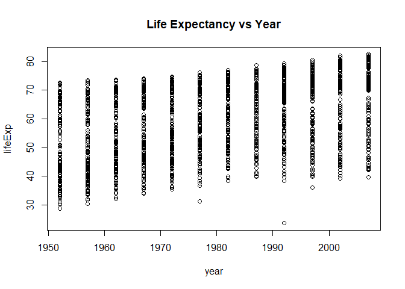
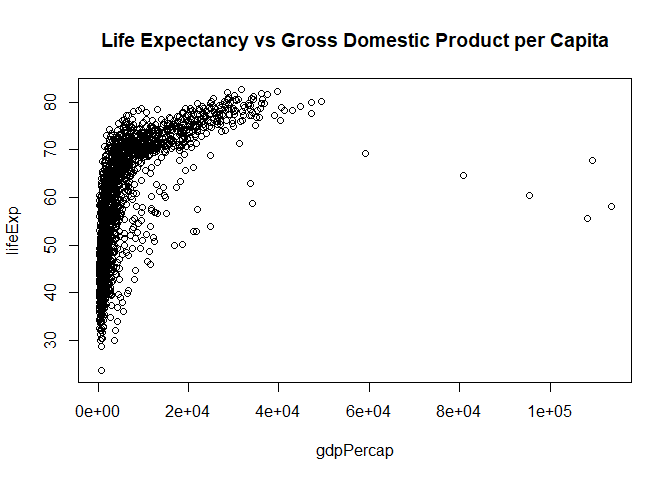
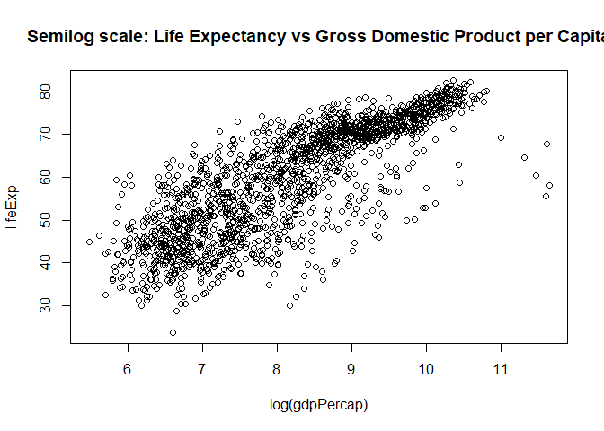

Gapminder Exploration
================
Hayden Scheiber
September 14, 2017

[Return to Homework 1 main page](https://github.com/HScheiber/STAT545-hw-Scheiber-Hayden/blob/master/hw01/README.md)

Gapminder: UN statistics on countries
=====================================

Below is a plot of Life Expectancy vs year for all countries covered by UN demographics data, beginning in 1952 and running up to the year 2007 in five year incriments.

-   Note the general trend towards longer life expectancies.
-   There are many possible reasons for this, but presumably most of the improvement is due to:
    -   Improvements in medical and agricultural technology.
    -   Increasing globalization, allowing for increased trade and ultimately more wealth.
    -   Improved relief efforts in natural disasters.
    -   Improvements in public education.

The UN recorded GDP per capita in the available data, and therefore we can look to see how strong the correlation between wealth and life expectancy really is.

This data is difficult to interpret with the current axes, perhaps a log scale plot of GDP per capita will improve the visualization:

Much better! This data suggests that there is a correlation between life expectancy and GDP per capita. We can see that rich countries tend to have long lifespans, but the correlation is no guarentee of causation. There are many poor countries with long life expectancies, so surely there are more variables at play!
