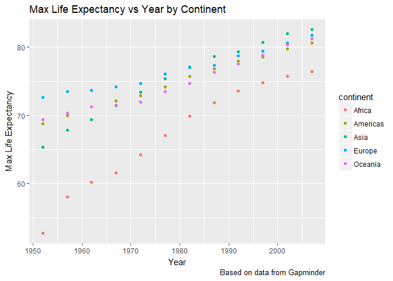
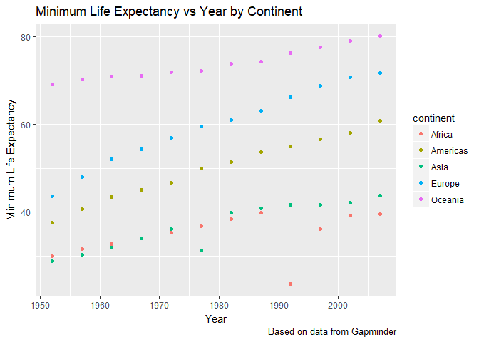

STAT 545 - Homework 2
================
Hayden Scheiber
September 21, 2017

Welcome! This is an exploration of the Gapminder data frame, as part of STAT 545 assignment 2. Click [here](/hw02/README.md) to return to the HW02 readme, or [here](README.md) to return to the main repository.

First course of action is to load the dataset and the tidyverse package.

``` r
library(gapminder)
library(tidyverse)
```

    ## Loading tidyverse: ggplot2
    ## Loading tidyverse: tibble
    ## Loading tidyverse: tidyr
    ## Loading tidyverse: readr
    ## Loading tidyverse: purrr
    ## Loading tidyverse: dplyr

    ## Conflicts with tidy packages ----------------------------------------------

    ## filter(): dplyr, stats
    ## lag():    dplyr, stats

Smell test the data: Exploring the Gapminder data set
-----------------------------------------------------

#### Is it a data.frame, a matrix, a vector, a list?

Now, we want to know the structure of the data we're working with!

``` r
str(gapminder)
```

    ## Classes 'tbl_df', 'tbl' and 'data.frame':    1704 obs. of  6 variables:
    ##  $ country  : Factor w/ 142 levels "Afghanistan",..: 1 1 1 1 1 1 1 1 1 1 ...
    ##  $ continent: Factor w/ 5 levels "Africa","Americas",..: 3 3 3 3 3 3 3 3 3 3 ...
    ##  $ year     : int  1952 1957 1962 1967 1972 1977 1982 1987 1992 1997 ...
    ##  $ lifeExp  : num  28.8 30.3 32 34 36.1 ...
    ##  $ pop      : int  8425333 9240934 10267083 11537966 13079460 14880372 12881816 13867957 16317921 22227415 ...
    ##  $ gdpPercap: num  779 821 853 836 740 ...

It looks like gapminder is a dataframe, or "tibble" since we loaded tidyverse. Let's find out more:

``` r
typeof(gapminder)
```

    ## [1] "list"

It seems that tibbles are a type of list.

#### What’s its class?

``` r
class(gapminder)
```

    ## [1] "tbl_df"     "tbl"        "data.frame"

So gapminder is a data frame, table, and tibble!

#### What data type is each variable?

``` r
names(gapminder)
```

    ## [1] "country"   "continent" "year"      "lifeExp"   "pop"       "gdpPercap"

``` r
sapply(gapminder, class)
```

    ##   country continent      year   lifeExp       pop gdpPercap 
    ##  "factor"  "factor" "integer" "numeric" "integer" "numeric"

A healthy mix of various classes. And the data types:

``` r
sapply(gapminder, typeof)
```

    ##   country continent      year   lifeExp       pop gdpPercap 
    ## "integer" "integer" "integer"  "double" "integer"  "double"

#### How many variables/columns? How many rows/observations?

Number of rows can be easily shown using the `nrow` function, whereas rows are shown with `ncol`

``` r
nrow(gapminder)
```

    ## [1] 1704

``` r
ncol(gapminder)
```

    ## [1] 6

#### Can you get these facts about “extent” or “size” in more than one way? Can you imagine different functions being useful in different - contexts?

``` r
dim(gapminder) #lists both dimensions of a data frame
```

    ## [1] 1704    6

``` r
length(gapminder) # also lists number of columns, may act differently for matrices
```

    ## [1] 6

``` r
dim(unique(gapminder)) # shows number of unique entries
```

    ## [1] 1704    6

Which function you use will depend on the needs of the particular script! In particular, using the `unique()` function could be a very effective way of sorting through data that contains a lot of repeated features.

Explore individual variables
----------------------------

Here we will take a closer look at a few of the variables in the gapminder dataset.

#### What are possible values (or range, whichever is appropriate) of each variable?

Lets begin with countries. How many are listed?

``` r
unique(gapminder$country) %>%
  length()
```

    ## [1] 142

So there are 142 countries in this dataset! We can list them nicely in alphabetical order with:

``` r
unique(select(gapminder, country))
```

    ## # A tibble: 142 x 1
    ##        country
    ##         <fctr>
    ##  1 Afghanistan
    ##  2     Albania
    ##  3     Algeria
    ##  4      Angola
    ##  5   Argentina
    ##  6   Australia
    ##  7     Austria
    ##  8     Bahrain
    ##  9  Bangladesh
    ## 10     Belgium
    ## # ... with 132 more rows

How about the range of years? What's in the earliest and latest year in the dataset?

``` r
range(gapminder$year)
```

    ## [1] 1952 2007

So the data set runs from 1952 to 2007.

Let's havea look at the life expectancy variable. How far does it range?

``` r
range(gapminder$lifeExp)
```

    ## [1] 23.599 82.603

That is quite the range! How about the range just in 2007, separately for each continent?

``` r
filter(gapminder, year == 2007) %>%
  group_by(continent) %>%
    summarize(minLifeExp2007=min(lifeExp), maxLifeExp2007=max(lifeExp))
```

    ## # A tibble: 5 x 3
    ##   continent minLifeExp2007 maxLifeExp2007
    ##      <fctr>          <dbl>          <dbl>
    ## 1    Africa         39.613         76.442
    ## 2  Americas         60.916         80.653
    ## 3      Asia         43.828         82.603
    ## 4    Europe         71.777         81.757
    ## 5   Oceania         80.204         81.235

#### What values are typical? What’s the spread? What’s the distribution? Etc., tailored to the variable at hand.

Let's take a look at a summary of the life expectancy:

``` r
summary(gapminder$lifeExp)
```

    ##    Min. 1st Qu.  Median    Mean 3rd Qu.    Max. 
    ##   23.60   48.20   60.71   59.47   70.85   82.60

We can plot max life expectancy vs year separately for each continent:

``` r
group_by(gapminder,continent,year) %>%
  summarize(MaxLifeExp=max(lifeExp)) %>%
  ggplot(aes(x=year, y=MaxLifeExp)) + 
  geom_point(aes(colour=continent)) +
  labs(title = "Max Life Expectancy vs Year by Continent", x = "Year", 
       y = "Max Life Expectancy",caption = "Based on data from Gapminder")
```



Or this minimum life expectancy:

``` r
group_by(gapminder,continent,year) %>%
  summarize(MinLifeExp=min(lifeExp)) %>%
  ggplot(aes(x=year, y=MinLifeExp)) + 
  geom_point(aes(colour=continent)) +
  labs(title = "Minimum Life Expectancy vs Year by Continent", x = "Year", 
       y = "Minimum Life Expectancy",caption = "Based on data from Gapminder")
```



Explore various plot types
--------------------------

Why don't we try making a stripplot to see the spread of life expectancies for each continent. We can colour code by year, and overlay the average (red dot)!

``` r
p <- ggplot(gapminder, aes(reorder(x = continent, lifeExp), y = lifeExp)) + 
  geom_jitter(aes(colour=year), position = position_jitter(width = 0.2, height = 0),alpha=0.2) +
  stat_summary(fun.y = mean, colour = "red", geom = "point", size = 3)
p + labs(title = "Life Expectancy In continents", x = "Continent", y = "Life Expectancy",caption = "Based on data from Gapminder")
```


That's pretty cool! A definite trend towards higher life expectancy as the years go on.

What about a histogram of life expectancy distribution in the 1990's, with colour overlay by continent?

``` r
filter(gapminder, year > 1989 | year < 2000) %>%
  ggplot(aes(x = lifeExp,fill = continent)) +
  geom_histogram(binwidth = 1) +
  labs(title = "Life Expectancy Distribution in the 90's", 
       x = "Life Expectancy", y = "Count",caption = "Based on data from Gapminder")
```


It might look better to plot this as a density plot:

``` r
filter(gapminder, year > 1989 | year < 2000) %>%
  ggplot(aes(x = lifeExp,fill = continent)) +
  geom_density(alpha = 0.2) +
  labs(title = "Life Expectancy Distribution in the 90's", 
       x = "Life Expectancy", y = "Count",caption = "Based on data from Gapminder")
```


Okay, I think we've seen enough of life expectancy per year, how about life expectancy vs GDP per capita, in 2002, where size is determined by the population size?

``` r
jPch <- 21
jDarkGray <- 'grey20'
jXlim <- c(150, 115000)
jYlim <- c(16, 100)

ggplot(subset(gapminder, year == 2002),
       aes(x = gdpPercap, y = lifeExp)) +
  scale_x_log10(limits = jXlim) + ylim(jYlim) +
  geom_point(aes(size = sqrt(pop)), pch = jPch, color = jDarkGray,
             show.legend = FALSE, alpha=0.5) + 
  scale_size_continuous(range=c(1,40)) +
  facet_wrap(~ continent) + coord_fixed(ratio = 1/43) +
  aes(fill = country) + scale_fill_manual(values = country_colors) +
  theme_bw() + theme(strip.text = element_text(size = rel(1.1))) + 
  labs(title = "Life Expectancy vs GDP per capita: 2002", 
      x = "GDP per Capita", y = "Life Expectancy",caption = "Based on data from Gapminder")
```


How about a bar graph of number of countries in each continent:

``` r
group_by(gapminder,continent) %>%
  summarize(NumberofCountries = length(unique(country))) -> bardata

ggplot(bardata, aes(x = continent, weight=NumberofCountries)) + geom_bar(fill="Red") +
  labs(title = "Number of countries in the Continents", 
      x = "Continent", y = "Number of Countries",caption = "Based on data from Gapminder")
```


Lastly, here's a bar plot of total wealth in each continent in 2007:

``` r
filter(gapminder, year == 2007) %>%
  group_by(country) %>%
  summarize(continent, CountryWealth = gdpPercap*pop) %>%
  group_by(continent) %>%
  summarize(TotalWealth = round( sum(CountryWealth)/1e12,digits = 1) ) -> bardata2

ggplot(bardata2, aes(x = continent, weight=TotalWealth)) + geom_bar(fill="Green") +
  labs(title = "Total Wealth in the Continents (2007)", 
      x = "Continent", y = "Total Wealth ($ Trillion)", caption = "Based on data from Gapminder")
```


But I want to do more!
----------------------

Here is some code. The analyst’s intent was to get the data for Rwanda and Afghanistan

``` r
filter(gapminder, country == c("Rwanda", "Afghanistan"))
```

    ## # A tibble: 12 x 6
    ##        country continent  year lifeExp      pop gdpPercap
    ##         <fctr>    <fctr> <int>   <dbl>    <int>     <dbl>
    ##  1 Afghanistan      Asia  1957  30.332  9240934  820.8530
    ##  2 Afghanistan      Asia  1967  34.020 11537966  836.1971
    ##  3 Afghanistan      Asia  1977  38.438 14880372  786.1134
    ##  4 Afghanistan      Asia  1987  40.822 13867957  852.3959
    ##  5 Afghanistan      Asia  1997  41.763 22227415  635.3414
    ##  6 Afghanistan      Asia  2007  43.828 31889923  974.5803
    ##  7      Rwanda    Africa  1952  40.000  2534927  493.3239
    ##  8      Rwanda    Africa  1962  43.000  3051242  597.4731
    ##  9      Rwanda    Africa  1972  44.600  3992121  590.5807
    ## 10      Rwanda    Africa  1982  46.218  5507565  881.5706
    ## 11      Rwanda    Africa  1992  23.599  7290203  737.0686
    ## 12      Rwanda    Africa  2002  43.413  7852401  785.6538

This is not correct! Here are two possible ways to do it correctly:

``` r
filter(gapminder, country %in% "Rwanda" | country == "Afghanistan")
```

    ## # A tibble: 24 x 6
    ##        country continent  year lifeExp      pop gdpPercap
    ##         <fctr>    <fctr> <int>   <dbl>    <int>     <dbl>
    ##  1 Afghanistan      Asia  1952  28.801  8425333  779.4453
    ##  2 Afghanistan      Asia  1957  30.332  9240934  820.8530
    ##  3 Afghanistan      Asia  1962  31.997 10267083  853.1007
    ##  4 Afghanistan      Asia  1967  34.020 11537966  836.1971
    ##  5 Afghanistan      Asia  1972  36.088 13079460  739.9811
    ##  6 Afghanistan      Asia  1977  38.438 14880372  786.1134
    ##  7 Afghanistan      Asia  1982  39.854 12881816  978.0114
    ##  8 Afghanistan      Asia  1987  40.822 13867957  852.3959
    ##  9 Afghanistan      Asia  1992  41.674 16317921  649.3414
    ## 10 Afghanistan      Asia  1997  41.763 22227415  635.3414
    ## # ... with 14 more rows

``` r
filter(gapminder, country == "Rwanda" | country == "Afghanistan")
```

    ## # A tibble: 24 x 6
    ##        country continent  year lifeExp      pop gdpPercap
    ##         <fctr>    <fctr> <int>   <dbl>    <int>     <dbl>
    ##  1 Afghanistan      Asia  1952  28.801  8425333  779.4453
    ##  2 Afghanistan      Asia  1957  30.332  9240934  820.8530
    ##  3 Afghanistan      Asia  1962  31.997 10267083  853.1007
    ##  4 Afghanistan      Asia  1967  34.020 11537966  836.1971
    ##  5 Afghanistan      Asia  1972  36.088 13079460  739.9811
    ##  6 Afghanistan      Asia  1977  38.438 14880372  786.1134
    ##  7 Afghanistan      Asia  1982  39.854 12881816  978.0114
    ##  8 Afghanistan      Asia  1987  40.822 13867957  852.3959
    ##  9 Afghanistan      Asia  1992  41.674 16317921  649.3414
    ## 10 Afghanistan      Asia  1997  41.763 22227415  635.3414
    ## # ... with 14 more rows
