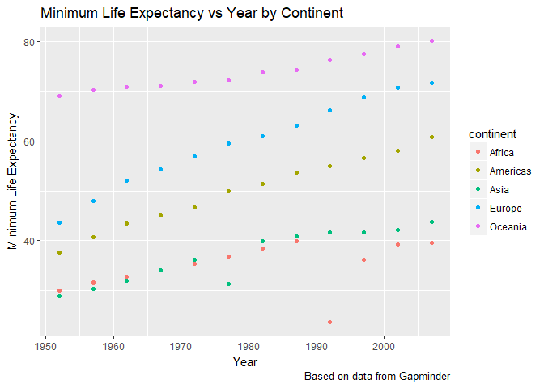
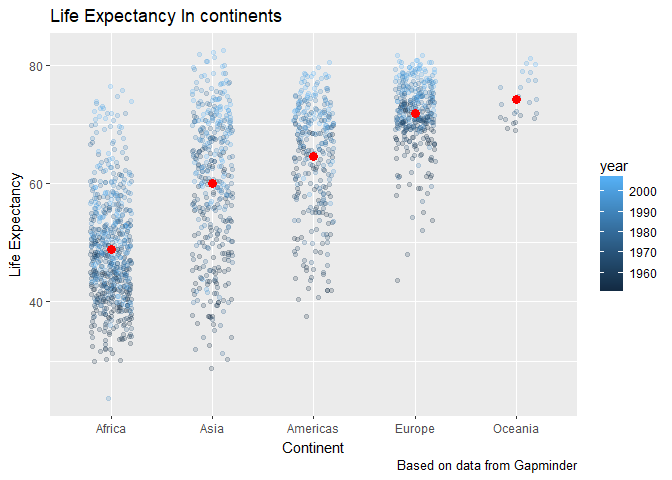
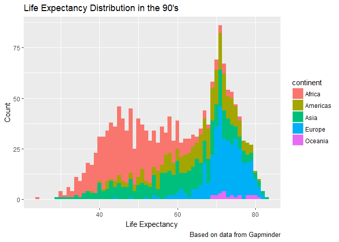
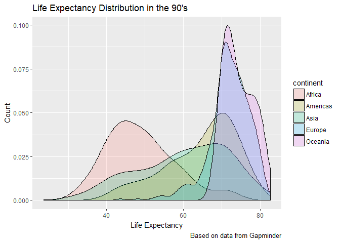
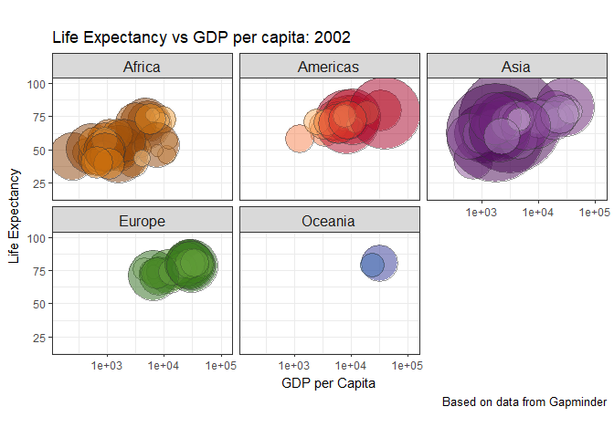
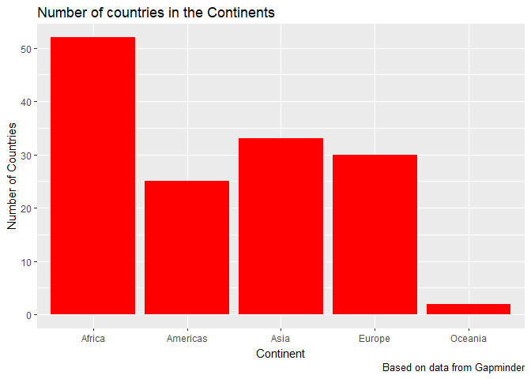
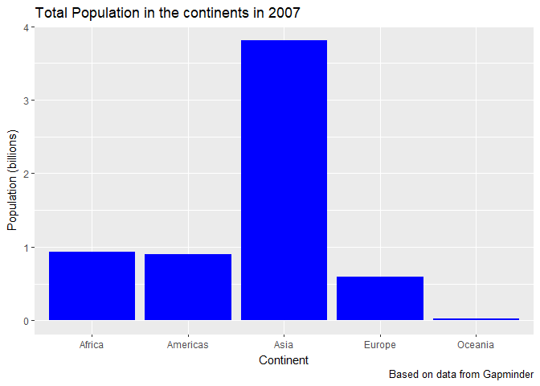
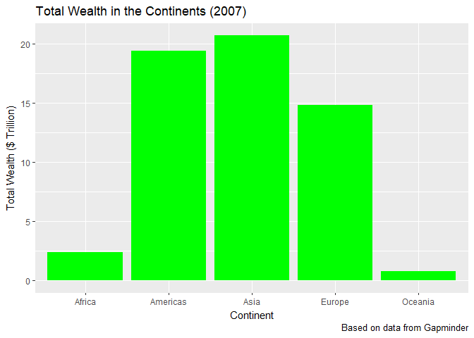

STAT 545 - Homework 2
================
Hayden Scheiber
September 21, 2017

Welcome! This is an exploration of the Gapminder data frame, as part of STAT 545 assignment 2. Click [here](/hw02/README.md) to return to the HW02 main page, or [here](README.md) to return to the main repository.

First course of action is to load the `gapminder` dataset and the `tidyverse` package, as well as `knitr` for nicer table outputs.

``` r
library(gapminder)
library(tidyverse)
library(knitr)
```

Smell test the data: Exploring the Gapminder data set
-----------------------------------------------------

#### Is it a data.frame, a matrix, a vector, a list?

Now, we want to know the structure of the data we're working with!

``` r
str(gapminder)
```

    ## Classes 'tbl_df', 'tbl' and 'data.frame':    1704 obs. of  6 variables:
    ##  $ country  : Factor w/ 142 levels "Afghanistan",..: 1 1 1 1 1 1 1 1 1 1 ...
    ##  $ continent: Factor w/ 5 levels "Africa","Americas",..: 3 3 3 3 3 3 3 3 3 3 ...
    ##  $ year     : int  1952 1957 1962 1967 1972 1977 1982 1987 1992 1997 ...
    ##  $ lifeExp  : num  28.8 30.3 32 34 36.1 ...
    ##  $ pop      : int  8425333 9240934 10267083 11537966 13079460 14880372 12881816 13867957 16317921 22227415 ...
    ##  $ gdpPercap: num  779 821 853 836 740 ...

It looks like gapminder is a dataframe, or "tibble" since we loaded tidyverse. Let's find out more:

``` r
typeof(gapminder)
```

    ## [1] "list"

It seems that tibbles are a type of list.

#### What’s its class?

``` r
class(gapminder)
```

    ## [1] "tbl_df"     "tbl"        "data.frame"

So gapminder is a data frame, table, and tibble!

#### What data type is each variable?

``` r
names(gapminder)
```

    ## [1] "country"   "continent" "year"      "lifeExp"   "pop"       "gdpPercap"

``` r
sapply(gapminder, class)
```

    ##   country continent      year   lifeExp       pop gdpPercap 
    ##  "factor"  "factor" "integer" "numeric" "integer" "numeric"

A healthy mix of various classes. And the data types:

``` r
sapply(gapminder, typeof)
```

    ##   country continent      year   lifeExp       pop gdpPercap 
    ## "integer" "integer" "integer"  "double" "integer"  "double"

#### How many variables/columns? How many rows/observations?

Number of rows can be easily shown using the `nrow` function, whereas columns are shown with `ncol`

``` r
nrow(gapminder)
```

    ## [1] 1704

``` r
ncol(gapminder)
```

    ## [1] 6

#### Can you get these facts about “extent” or “size” in more than one way? Can you imagine different functions being useful in different - contexts?

We can use `dim` to get both the number of rows and number of columns:

``` r
dim(gapminder)
```

    ## [1] 1704    6

The function `length()` outputs the number of elements in a list. In the case of the gapminder dataframe, each column is itself a list. Therefore, `length(gapminder)` should output the number of columns.

``` r
length(gapminder)
```

    ## [1] 6

A useful function to use when trying to find how many unique data points are in a list is to use `unique()`. For the gapminder dataset, each row and each column is unique, so it won't change the output of `dim()`.

``` r
dim(unique(gapminder))
```

    ## [1] 1704    6

However, we could use `unique()` to help find the number of continents.

``` r
unique(gapminder$continent) %>%
  length()
```

    ## [1] 5

Without the `unique()` function, we can only see the total number of entries in the `continent` column.

``` r
gapminder$continent %>%
  length()
```

    ## [1] 1704

Which function you use will depend on the needs of the particular script! In particular, using the `unique()` function is a very effective way of sorting through data that contains a lot of repeated features.

Explore individual variables
----------------------------

Here we will take a closer look at a few of the variables in the gapminder dataset.

#### What are possible values (or range, whichever is appropriate) of each variable?

Lets begin with countries. How many are listed?

``` r
unique(gapminder$country) %>%
  length()
```

    ## [1] 142

So there are 142 countries in this dataset! We can list the first 10 nicely in alphabetical order with:

``` r
unique(select(gapminder, country)) %>%
  head(10) %>%
  kable(digits = 2, align = rep("l", 10),padding = 2)
```

| country     |
|:------------|
| Afghanistan |
| Albania     |
| Algeria     |
| Angola      |
| Argentina   |
| Australia   |
| Austria     |
| Bahrain     |
| Bangladesh  |
| Belgium     |

How about the range of years? What's in the earliest and latest year in the dataset?

``` r
range(gapminder$year)
```

    ## [1] 1952 2007

So the data set runs from 1952 to 2007.

Let's have a look at the life expectancy variable. How far does it range?

``` r
range(gapminder$lifeExp)
```

    ## [1] 23.599 82.603

That is quite the range! How about the range just in 2007, separately for each continent?

``` r
filter(gapminder, year == 2007) %>%
  group_by(continent) %>%
  summarize(minLifeExp2007=min(lifeExp), maxLifeExp2007=max(lifeExp)) %>%
  kable(digits = 2, align = rep("l", 10),padding = 10)
```

| continent | minLifeExp2007 | maxLifeExp2007 |
|:----------|:---------------|:---------------|
| Africa    | 39.61          | 76.44          |
| Americas  | 60.92          | 80.65          |
| Asia      | 43.83          | 82.60          |
| Europe    | 71.78          | 81.76          |
| Oceania   | 80.20          | 81.23          |

#### What values are typical? What’s the spread? What’s the distribution? Etc., tailored to the variable at hand.

Let's take a look at a summary of the life expectancy:

``` r
summary(gapminder$lifeExp)
```

    ##    Min. 1st Qu.  Median    Mean 3rd Qu.    Max. 
    ##   23.60   48.20   60.71   59.47   70.85   82.60

We can plot max life expectancy vs year separately for each continent:

``` r
group_by(gapminder,continent,year) %>%
  summarize(MaxLifeExp=max(lifeExp)) %>%
  ggplot(aes(x=year, y=MaxLifeExp)) + 
  geom_point(aes(colour=continent)) +
  labs(title = "Max Life Expectancy vs Year by Continent", x = "Year", 
       y = "Max Life Expectancy",caption = "Based on data from Gapminder")
```


Or the minimum life expectancy:

``` r
group_by(gapminder,continent,year) %>%
  summarize(MinLifeExp=min(lifeExp)) %>%
  ggplot(aes(x=year, y=MinLifeExp)) + 
  geom_point(aes(colour=continent)) +
  labs(title = "Minimum Life Expectancy vs Year by Continent", x = "Year", 
       y = "Minimum Life Expectancy",caption = "Based on data from Gapminder")
```



Explore various plot types
--------------------------

Why don't we try making a stripplot to see the spread of life expectancies for each continent. We can colour code by year, and overlay the average (red dot)!

``` r
p <- ggplot(gapminder, aes(reorder(x = continent, lifeExp), y = lifeExp)) + 
  geom_jitter(aes(colour=year), position = position_jitter(width = 0.2, height = 0),alpha=0.2) +
  stat_summary(fun.y = mean, colour = "red", geom = "point", size = 3)
p + labs(title = "Life Expectancy In continents", x = "Continent", 
         y = "Life Expectancy",caption = "Based on data from Gapminder")
```



That's pretty cool! A definite trend towards higher life expectancy as the years go on.

What about a histogram of life expectancy distribution in the 1990's, with colour overlay by continent?

``` r
filter(gapminder, year > 1989 | year < 2000) %>%
  ggplot(aes(x = lifeExp,fill = continent)) +
  geom_histogram(binwidth = 1) +
  labs(title = "Life Expectancy Distribution in the 90's", 
       x = "Life Expectancy", y = "Count",caption = "Based on data from Gapminder")
```



It might look better to plot this as a density plot:

``` r
filter(gapminder, year > 1989 | year < 2000) %>%
  ggplot(aes(x = lifeExp,fill = continent)) +
  geom_density(alpha = 0.2) +
  labs(title = "Life Expectancy Distribution in the 90's", 
       x = "Life Expectancy", y = "Count",caption = "Based on data from Gapminder")
```



Okay, I think we've seen enough of life expectancy per year, how about life expectancy vs GDP per capita, in 2002, where size is determined by the population size?

``` r
jPch <- 21
jDarkGray <- 'grey20'
jXlim <- c(150, 115000)
jYlim <- c(16, 100)

ggplot(subset(gapminder, year == 2002),
       aes(x = gdpPercap, y = lifeExp)) +
  scale_x_log10(limits = jXlim) + ylim(jYlim) +
  geom_point(aes(size = sqrt(pop)), pch = jPch, color = jDarkGray,
             show.legend = FALSE, alpha=0.5) + 
  scale_size_continuous(range=c(1,40)) +
  facet_wrap(~ continent) + coord_fixed(ratio = 1/43) +
  aes(fill = country) + scale_fill_manual(values = country_colors) +
  theme_bw() + theme(strip.text = element_text(size = rel(1.1))) + 
  labs(title = "Life Expectancy vs GDP per capita: 2002", 
      x = "GDP per Capita", y = "Life Expectancy",caption = "Based on data from Gapminder")
```



How about a bar graph of number of countries in each continent:

``` r
group_by(gapminder,continent) %>%
  summarize(NumberofCountries = length(unique(country))) -> bardata

ggplot(bardata, aes(x = continent, weight=NumberofCountries)) + geom_bar(fill="Red") +
  labs(title = "Number of countries in the Continents", 
      x = "Continent", y = "Number of Countries",caption = "Based on data from Gapminder")
```



Now let's see the total population of each continent.

``` r
filter(gapminder, year == 2007) %>%
  group_by(continent) %>%
  summarize(TotalPop = round(sum(as.numeric(pop))/1e9,digits = 2)) -> bardata2

ggplot(bardata2, aes(x = continent, weight=TotalPop)) + geom_bar(fill="Blue") +
  labs(title = "Total Population in the continents in 2007", 
      x = "Continent", y = "Population (billions)",caption = "Based on data from Gapminder")
```



Lastly, let's compare that with a bar plot of total wealth in each continent in 2007:

``` r
filter(gapminder, year == 2007) %>%
  group_by(country) %>%
  summarize(continent, CountryWealth = gdpPercap*pop) %>%
  group_by(continent) %>%
  summarize(TotalWealth = round( sum(CountryWealth)/1e12,digits = 1) ) -> bardata3

ggplot(bardata3, aes(x = continent, weight=TotalWealth)) + geom_bar(fill="Green") +
  labs(title = "Total Wealth in the Continents (2007)", 
      x = "Continent", y = "Total Wealth ($ Trillion)", caption = "Based on data from Gapminder") 
```



But I want to do more!
----------------------

Here is some code. The analyst’s intent was to get the data for Rwanda and Afghanistan

``` r
filter(gapminder, country == c("Rwanda", "Afghanistan")) %>%
  kable(digits = 2, align = rep("l", 10),padding = 10)
```

| country     | continent | year | lifeExp | pop      | gdpPercap |
|:------------|:----------|:-----|:--------|:---------|:----------|
| Afghanistan | Asia      | 1957 | 30.33   | 9240934  | 820.85    |
| Afghanistan | Asia      | 1967 | 34.02   | 11537966 | 836.20    |
| Afghanistan | Asia      | 1977 | 38.44   | 14880372 | 786.11    |
| Afghanistan | Asia      | 1987 | 40.82   | 13867957 | 852.40    |
| Afghanistan | Asia      | 1997 | 41.76   | 22227415 | 635.34    |
| Afghanistan | Asia      | 2007 | 43.83   | 31889923 | 974.58    |
| Rwanda      | Africa    | 1952 | 40.00   | 2534927  | 493.32    |
| Rwanda      | Africa    | 1962 | 43.00   | 3051242  | 597.47    |
| Rwanda      | Africa    | 1972 | 44.60   | 3992121  | 590.58    |
| Rwanda      | Africa    | 1982 | 46.22   | 5507565  | 881.57    |
| Rwanda      | Africa    | 1992 | 23.60   | 7290203  | 737.07    |
| Rwanda      | Africa    | 2002 | 43.41   | 7852401  | 785.65    |

This is not correct! Here are two possible ways to do it correctly:

``` r
filter(gapminder, country %in% "Rwanda" | country == "Afghanistan") %>%
  kable(digits = 2, align = rep("l", 10),padding = 10)
```

| country     | continent | year | lifeExp | pop      | gdpPercap |
|:------------|:----------|:-----|:--------|:---------|:----------|
| Afghanistan | Asia      | 1952 | 28.80   | 8425333  | 779.45    |
| Afghanistan | Asia      | 1957 | 30.33   | 9240934  | 820.85    |
| Afghanistan | Asia      | 1962 | 32.00   | 10267083 | 853.10    |
| Afghanistan | Asia      | 1967 | 34.02   | 11537966 | 836.20    |
| Afghanistan | Asia      | 1972 | 36.09   | 13079460 | 739.98    |
| Afghanistan | Asia      | 1977 | 38.44   | 14880372 | 786.11    |
| Afghanistan | Asia      | 1982 | 39.85   | 12881816 | 978.01    |
| Afghanistan | Asia      | 1987 | 40.82   | 13867957 | 852.40    |
| Afghanistan | Asia      | 1992 | 41.67   | 16317921 | 649.34    |
| Afghanistan | Asia      | 1997 | 41.76   | 22227415 | 635.34    |
| Afghanistan | Asia      | 2002 | 42.13   | 25268405 | 726.73    |
| Afghanistan | Asia      | 2007 | 43.83   | 31889923 | 974.58    |
| Rwanda      | Africa    | 1952 | 40.00   | 2534927  | 493.32    |
| Rwanda      | Africa    | 1957 | 41.50   | 2822082  | 540.29    |
| Rwanda      | Africa    | 1962 | 43.00   | 3051242  | 597.47    |
| Rwanda      | Africa    | 1967 | 44.10   | 3451079  | 510.96    |
| Rwanda      | Africa    | 1972 | 44.60   | 3992121  | 590.58    |
| Rwanda      | Africa    | 1977 | 45.00   | 4657072  | 670.08    |
| Rwanda      | Africa    | 1982 | 46.22   | 5507565  | 881.57    |
| Rwanda      | Africa    | 1987 | 44.02   | 6349365  | 847.99    |
| Rwanda      | Africa    | 1992 | 23.60   | 7290203  | 737.07    |
| Rwanda      | Africa    | 1997 | 36.09   | 7212583  | 589.94    |
| Rwanda      | Africa    | 2002 | 43.41   | 7852401  | 785.65    |
| Rwanda      | Africa    | 2007 | 46.24   | 8860588  | 863.09    |

``` r
filter(gapminder, country == "Rwanda" | country == "Afghanistan") %>%
  kable(digits = 2, align = rep("l", 10),padding = 10)
```

| country     | continent | year | lifeExp | pop      | gdpPercap |
|:------------|:----------|:-----|:--------|:---------|:----------|
| Afghanistan | Asia      | 1952 | 28.80   | 8425333  | 779.45    |
| Afghanistan | Asia      | 1957 | 30.33   | 9240934  | 820.85    |
| Afghanistan | Asia      | 1962 | 32.00   | 10267083 | 853.10    |
| Afghanistan | Asia      | 1967 | 34.02   | 11537966 | 836.20    |
| Afghanistan | Asia      | 1972 | 36.09   | 13079460 | 739.98    |
| Afghanistan | Asia      | 1977 | 38.44   | 14880372 | 786.11    |
| Afghanistan | Asia      | 1982 | 39.85   | 12881816 | 978.01    |
| Afghanistan | Asia      | 1987 | 40.82   | 13867957 | 852.40    |
| Afghanistan | Asia      | 1992 | 41.67   | 16317921 | 649.34    |
| Afghanistan | Asia      | 1997 | 41.76   | 22227415 | 635.34    |
| Afghanistan | Asia      | 2002 | 42.13   | 25268405 | 726.73    |
| Afghanistan | Asia      | 2007 | 43.83   | 31889923 | 974.58    |
| Rwanda      | Africa    | 1952 | 40.00   | 2534927  | 493.32    |
| Rwanda      | Africa    | 1957 | 41.50   | 2822082  | 540.29    |
| Rwanda      | Africa    | 1962 | 43.00   | 3051242  | 597.47    |
| Rwanda      | Africa    | 1967 | 44.10   | 3451079  | 510.96    |
| Rwanda      | Africa    | 1972 | 44.60   | 3992121  | 590.58    |
| Rwanda      | Africa    | 1977 | 45.00   | 4657072  | 670.08    |
| Rwanda      | Africa    | 1982 | 46.22   | 5507565  | 881.57    |
| Rwanda      | Africa    | 1987 | 44.02   | 6349365  | 847.99    |
| Rwanda      | Africa    | 1992 | 23.60   | 7290203  | 737.07    |
| Rwanda      | Africa    | 1997 | 36.09   | 7212583  | 589.94    |
| Rwanda      | Africa    | 2002 | 43.41   | 7852401  | 785.65    |
| Rwanda      | Africa    | 2007 | 46.24   | 8860588  | 863.09    |

So what was the analyst's code actually doing? Well its easier to see with a small example. I first generate a test list of names, with `bob` repeated 3 times. We want to compare this to a smaller list of just `mike` and `bob`. With the syntax below, one name from the 2-name list is compared against each of the names in `testdata` one at a time.

``` r
data <- c("bob", "fred", "mike","bob","bob")
comparelist <- c("mike","bob")
data == comparelist
```

    ## Warning in data == comparelist: longer object length is not a multiple of
    ## shorter object length

    ## [1] FALSE FALSE  TRUE  TRUE FALSE

The flow of comparisons looks like `comparelist[1] == data[1]`, `comparelist[2] == data[2]` -now we come to the end of `comparelist` so it loops back to the start-`comparelist[1] == data[3]`, `comparelist[2] == data[4]`, `comparelist[1] == data[5]`. Also note the warning message, which occured because the final comparison was not between the final item in each list.

So we see that the boolean comparison is going through both lists in parallel, not what the analyst intended at all! Hence, only about half the `Rawada` and `Afghanistan` data was output.
