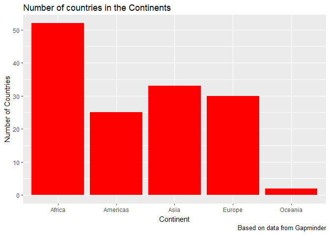

Homework 3 - Gapminder Manipulation and Exploration with dplyr
================
Hayden Scheiber
September 26, 2017

Welcome! This is an exploration of the Gapminder data frame, as part of STAT 545 assignment 2. Click [here](README.md) to return to the homework 3 landing page, or [here](https://github.com/HScheiber/STAT545-hw-Scheiber-Hayden/blob/master/README.md) to return repository home page.

First we need to load the `gapminder` dataset and the `tidyverse` package, as well as `knitr` for nicer table outputs.

``` r
library(gapminder)
library(tidyverse)
library(knitr)
```

Here's an example of how to use `knitr::kable()` to make nicer looking tables. The `head()` command outputs the first `n` rows of an input data frame.

``` r
knitr::kable(head(gapminder,n=15))
```

| country     | continent |  year|  lifeExp|       pop|  gdpPercap|
|:------------|:----------|-----:|--------:|---------:|----------:|
| Afghanistan | Asia      |  1952|   28.801|   8425333|   779.4453|
| Afghanistan | Asia      |  1957|   30.332|   9240934|   820.8530|
| Afghanistan | Asia      |  1962|   31.997|  10267083|   853.1007|
| Afghanistan | Asia      |  1967|   34.020|  11537966|   836.1971|
| Afghanistan | Asia      |  1972|   36.088|  13079460|   739.9811|
| Afghanistan | Asia      |  1977|   38.438|  14880372|   786.1134|
| Afghanistan | Asia      |  1982|   39.854|  12881816|   978.0114|
| Afghanistan | Asia      |  1987|   40.822|  13867957|   852.3959|
| Afghanistan | Asia      |  1992|   41.674|  16317921|   649.3414|
| Afghanistan | Asia      |  1997|   41.763|  22227415|   635.3414|
| Afghanistan | Asia      |  2002|   42.129|  25268405|   726.7341|
| Afghanistan | Asia      |  2007|   43.828|  31889923|   974.5803|
| Albania     | Europe    |  1952|   55.230|   1282697|  1601.0561|
| Albania     | Europe    |  1957|   59.280|   1476505|  1942.2842|
| Albania     | Europe    |  1962|   64.820|   1728137|  2312.8890|

Task Menu
---------

#### Get the maximum and minimum of GDP per capita for all continents.

This can be acheived easily using the `group_by()` combined with `summarize()`. Below, I group the gapminder data frame by continent and pipe that result into the summarize function, where I utilize the `max()` and `min()` functions to find the range of GDP per capita for each continent.

``` r
p1 <- group_by(gapminder,continent) %>%
  summarize(Max_GDPperCap=max(gdpPercap), Min_GPDperCap = min(gdpPercap))
knitr::kable(p1)
```

| continent |  Max\_GDPperCap|  Min\_GPDperCap|
|:----------|---------------:|---------------:|
| Africa    |        21951.21|        241.1659|
| Americas  |        42951.65|       1201.6372|
| Asia      |       113523.13|        331.0000|
| Europe    |        49357.19|        973.5332|
| Oceania   |        34435.37|      10039.5956|

Now we can plot this as a nice bar plot

``` r
group_by(gapminder,continent) %>%
  summarize(NumberofCountries = length(unique(country))) -> bardata

ggplot(bardata, aes(x = continent, weight=NumberofCountries)) + geom_bar(fill="Red") +
  labs(title = "Number of countries in the Continents", 
      x = "Continent", y = "Number of Countries",caption = "Based on data from Gapminder")
```


