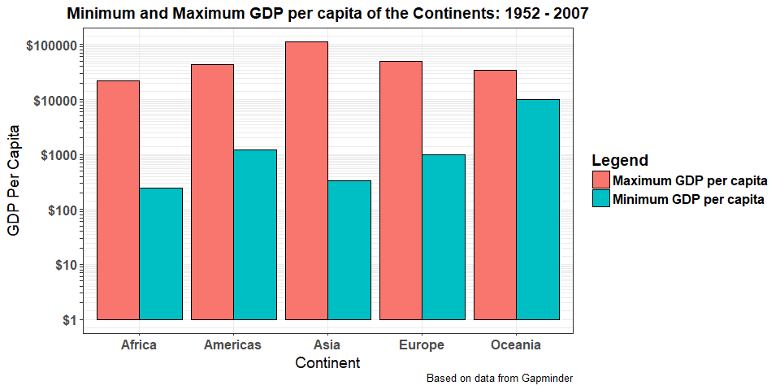
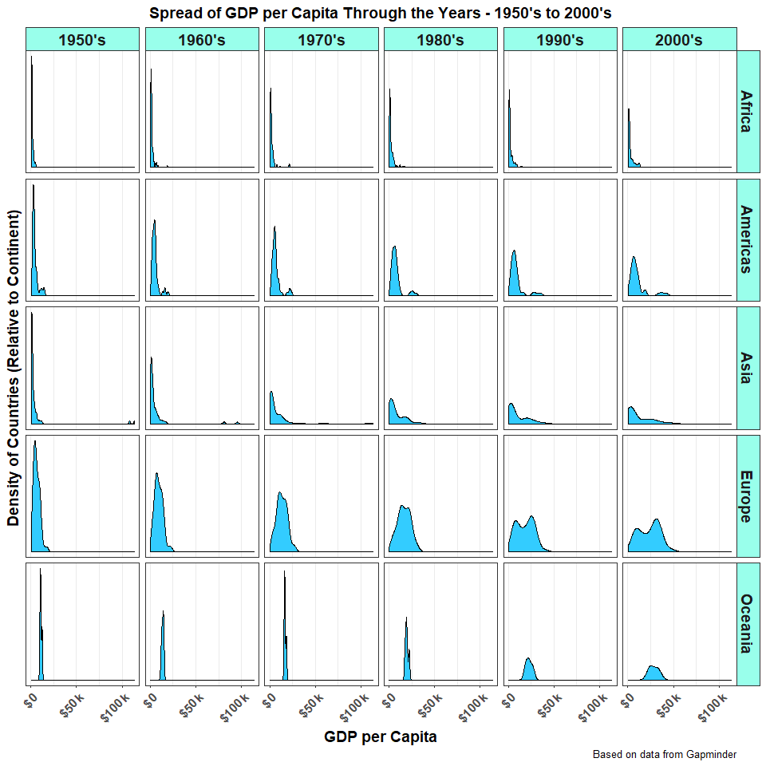
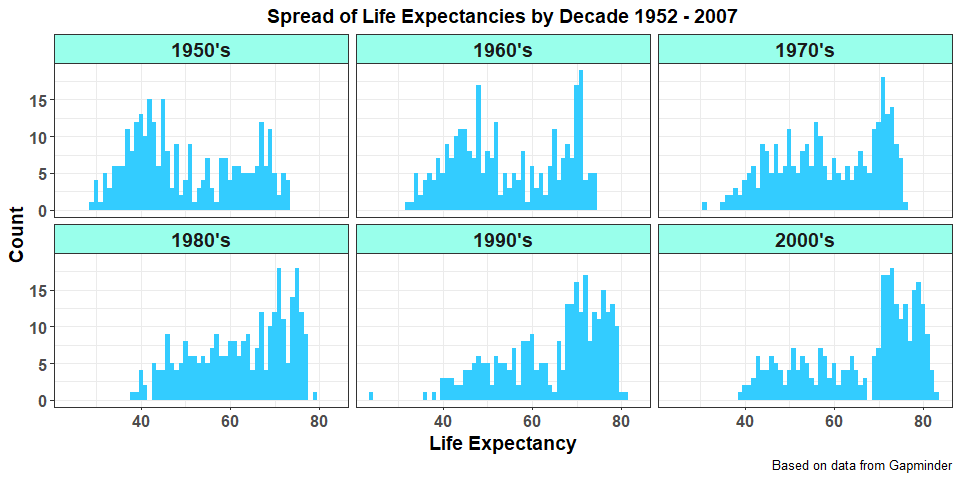
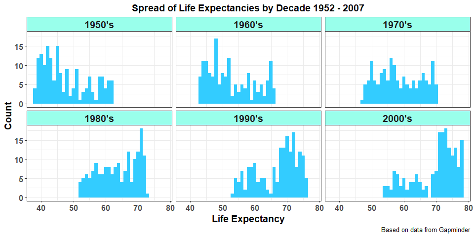
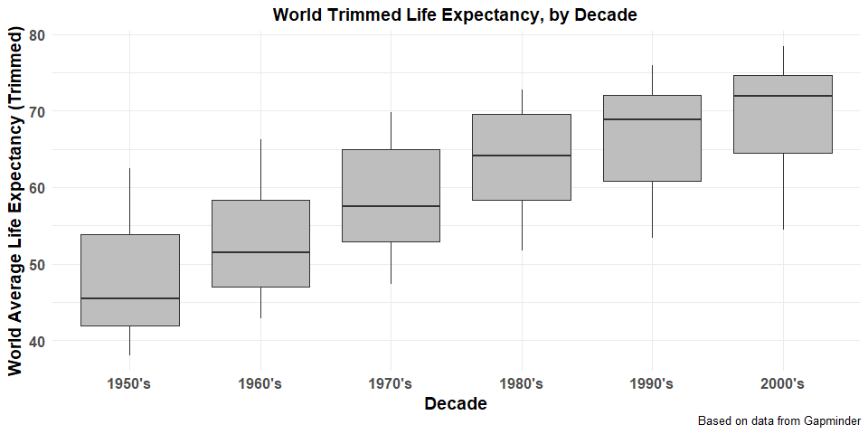
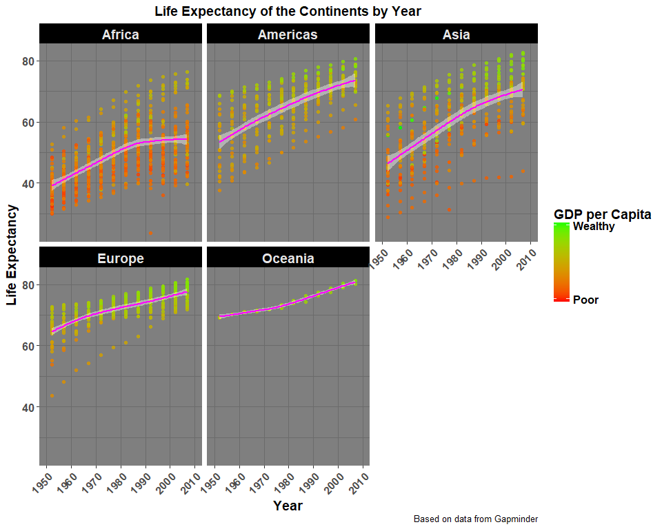
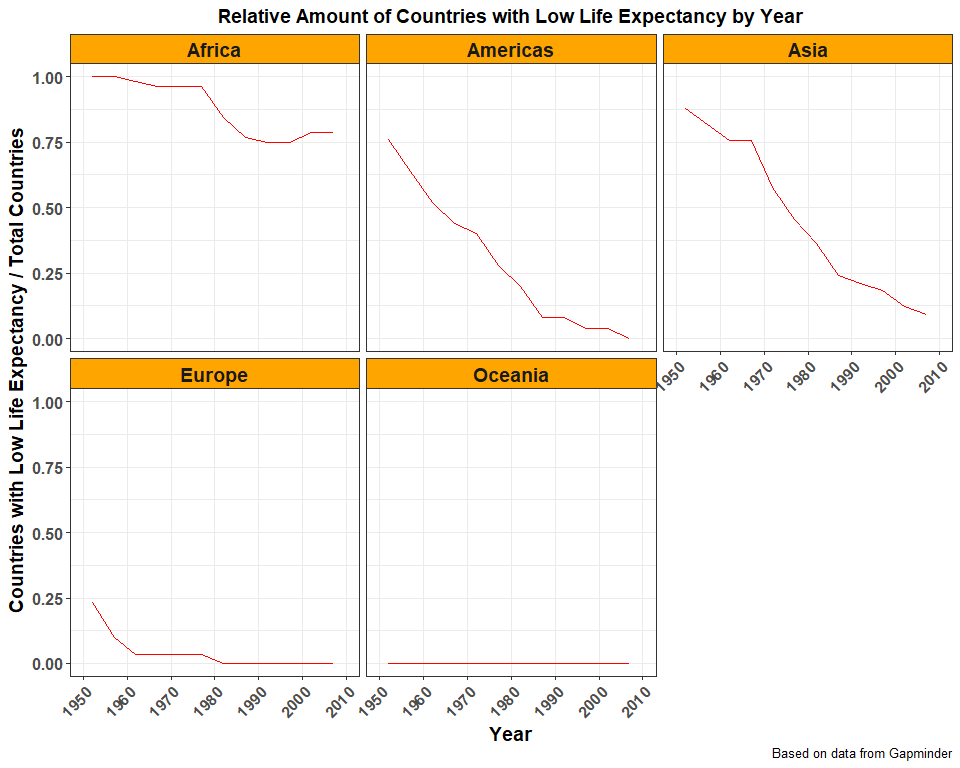

Homework 3 - Gapminder Manipulation and Exploration with dplyr
================
Hayden Scheiber -
03 November, 2017

[Return to Main Page](https://github.com/HScheiber/STAT545-hw-Scheiber-Hayden/blob/master/README.md)

[Return to Homework 3 Landing Page](README.md)

------------------------------------------------------------------------

-   [1 - Get the maximum and minimum of GDP per capita for all continents](#1---get-the-maximum-and-minimum-of-gdp-per-capita-for-all-continents)

-   [2 - Look at the spread of GDP per capita within the continents](#2---look-at-the-spread-of-gdp-per-capita-within-the-continents)

-   [3 - Compute a trimmed mean of life expectancy for different years](#3---compute-a-trimmed-mean-of-life-expectancy-for-different-years)

-   [4 - How is life expectancy changing over time on different continents?](#4---how-is-life-expectancy-changing-over-time-on-different-continents?)

-   [5 - Report the relative abundance of countries with low life expectancy over time by continent](#5---report-the-relative-abundance-of-countries-with-low-life-expectancy-over-time-by-continent)

------------------------------------------------------------------------

Welcome! This is an exploration of the Gapminder data frame using `ggplot2`, as part of STAT 545 assignment 3.

First we need to load the `gapminder` dataset and the `tidyverse` package, as well as `knitr` for nicer table outputs. When making my plots I realized that I needed to re-shaped a data-frame using a function from `reshape2`, so I load that library as well.

``` r
suppressPackageStartupMessages(library(gapminder))
suppressPackageStartupMessages(library(tidyverse))
```

    ## Warning: package 'tidyverse' was built under R version 3.4.2

``` r
suppressPackageStartupMessages(library(knitr))
suppressPackageStartupMessages(library(reshape2))
```

Here's an example of how to use `knitr::kable()` to make nicer looking tables. The `head()` command outputs the first `n` rows of an input data frame.

``` r
knitr::kable(head(gapminder,n=15))
```

| country     | continent |  year|  lifeExp|       pop|  gdpPercap|
|:------------|:----------|-----:|--------:|---------:|----------:|
| Afghanistan | Asia      |  1952|   28.801|   8425333|   779.4453|
| Afghanistan | Asia      |  1957|   30.332|   9240934|   820.8530|
| Afghanistan | Asia      |  1962|   31.997|  10267083|   853.1007|
| Afghanistan | Asia      |  1967|   34.020|  11537966|   836.1971|
| Afghanistan | Asia      |  1972|   36.088|  13079460|   739.9811|
| Afghanistan | Asia      |  1977|   38.438|  14880372|   786.1134|
| Afghanistan | Asia      |  1982|   39.854|  12881816|   978.0114|
| Afghanistan | Asia      |  1987|   40.822|  13867957|   852.3959|
| Afghanistan | Asia      |  1992|   41.674|  16317921|   649.3414|
| Afghanistan | Asia      |  1997|   41.763|  22227415|   635.3414|
| Afghanistan | Asia      |  2002|   42.129|  25268405|   726.7341|
| Afghanistan | Asia      |  2007|   43.828|  31889923|   974.5803|
| Albania     | Europe    |  1952|   55.230|   1282697|  1601.0561|
| Albania     | Europe    |  1957|   59.280|   1476505|  1942.2842|
| Albania     | Europe    |  1962|   64.820|   1728137|  2312.8890|

#### 1 - Get the maximum and minimum of GDP per capita for all continents

<a href="#top">Back to top</a>

This can be acheived easily using the `group_by()` combined with `summarize()`. Below, I group the gapminder data frame by continent and pipe that result into the summarize function, where I utilize the `max()` and `min()` functions to find the range of GDP per capita for each continent.

``` r
p1 <- group_by(gapminder,continent) %>%
  summarize(Max_GDPperCap=max(gdpPercap), Min_GPDperCap = min(gdpPercap)) 
knitr::kable(p1)
```

| continent |  Max\_GDPperCap|  Min\_GPDperCap|
|:----------|---------------:|---------------:|
| Africa    |        21951.21|        241.1659|
| Americas  |        42951.65|       1201.6372|
| Asia      |       113523.13|        331.0000|
| Europe    |        49357.19|        973.5332|
| Oceania   |        34435.37|      10039.5956|

I want to compare the min and max gdp per capita on the same plot. In order to do this, i need to utilize `reshape2::melt()` to get both GDP minimum and maximum under the same variable. I'm not sure if this is the only solution to my problem, but I couldn't find any other way to easily do this.

``` r
p2 <- reshape2::melt(p1,id = c("continent"))

knitr::kable(p2)
```

| continent | variable       |        value|
|:----------|:---------------|------------:|
| Africa    | Max\_GDPperCap |   21951.2118|
| Americas  | Max\_GDPperCap |   42951.6531|
| Asia      | Max\_GDPperCap |  113523.1329|
| Europe    | Max\_GDPperCap |   49357.1902|
| Oceania   | Max\_GDPperCap |   34435.3674|
| Africa    | Min\_GPDperCap |     241.1659|
| Americas  | Min\_GPDperCap |    1201.6372|
| Asia      | Min\_GPDperCap |     331.0000|
| Europe    | Min\_GPDperCap |     973.5332|
| Oceania   | Min\_GPDperCap |   10039.5956|

With above reorganized data frame, we can plot min and max GDP of each continent side-by side in the same bar plot. I took a lot of time to add theme changes here to spice things up a bit. I also spent some time to figure out how to include only some labels on the breaks of the y axis, as I used a log y-axis. Producing this plot was a learning experience for me. I even utilized a `for` loop!

``` r
# Define a vector of values for the log scale break lines, %o% is the outer product of the two lists
breakvector <- c(1:10 %o% 10^(0:4))
# Disable scientific notation
options(scipen=5)
# initialize a blank list of equal length for the labels of the breaks
labelvector = vector("list",length(breakvector))

# Loop over all labels in 'labelvector' variable
for (i in 1:length(labelvector)) {
  if (i %% 10 == 0 | i == 1) {
    # Include the label for every 10th line break (ie $1, $10, $100...)
    labelvector[i] <- paste("$",toString(breakvector[i]),sep="")
  }else{
    # For all other line breaks, include blank label
    labelvector[i] <- ""
  }
}

p2 %>%
  ggplot(aes(x = continent, y = value, fill = variable)) + 
  geom_bar(stat="identity", position='dodge',color='black') + 
  scale_fill_discrete("Legend", # Modifying legend title and labels
      labels = c("Maximum GDP per capita",
                 "Minimum GDP per capita")) + 
  # Adding log scale lines, keeping only some labels
  scale_y_log10(breaks=breakvector,
      labels=labelvector) +
  theme_bw() + # black and white theme
  theme(axis.title = element_text(size=14),
      strip.text = element_text(size=14, face="bold"),
      plot.title = element_text(size=14, face="bold",hjust = 0.49),
      axis.text.x = element_text(size=12,face ="bold"),
      axis.text.y = element_text(size=12,face ="bold"),
      legend.title = element_text(size=14, face ="bold"),
      legend.text = element_text(size=12, face ="bold")) +
  labs(x = "Continent", 
      y = "GDP Per Capita",
      title = "Minimum and Maximum GDP per capita of the Continents: 1952 - 2007",
      caption = "Based on data from Gapminder")
```



#### 2 - Look at the spread of GDP per capita within the continents

<a href="#top">Back to top</a>

For this, we need to group the data set by continent. I also want to define a new variable `decade` which is simply the decade that each data point occurs in. We can start with a table of minimum, maximum, mean, and standard deviation for some of the data, but it doesn't help visualize it very well.

``` r
p3 <- gapminder %>%
  mutate(decade = paste(substr(year, 1, 3),"0's",sep="")) %>% # Add a decade column by taking the 3rd digit of the year and pasting 0 to it.
  group_by(continent, decade)

p4 <- p3 %>% 
  summarize(min_gdpPercap = min(gdpPercap), 
    max_gdpPercap = max(gdpPercap), 
    average = mean(gdpPercap), 
    standard_dev = sd(gdpPercap))
  
knitr::kable(head(p4,n=10))
```

| continent | decade |  min\_gdpPercap|  max\_gdpPercap|   average|  standard\_dev|
|:----------|:-------|---------------:|---------------:|---------:|--------------:|
| Africa    | 1950's |        298.8462|        5487.104|  1318.904|       1058.375|
| Africa    | 1960's |        355.2032|       18772.752|  1824.221|       2263.875|
| Africa    | 1970's |        464.0995|       21951.212|  2462.777|       3723.038|
| Africa    | 1980's |        389.8762|       17364.275|  2382.131|       2911.674|
| Africa    | 1990's |        312.1884|       14722.842|  2330.285|       2720.962|
| Africa    | 2000's |        241.1659|       13206.485|  2844.209|       3304.233|
| Americas  | 1950's |       1397.7171|       14847.127|  4347.553|       3140.187|
| Americas  | 1960's |       1452.0577|       19530.366|  5284.898|       3790.048|
| Americas  | 1970's |       1654.4569|       24072.632|  6921.671|       5030.810|
| Americas  | 1980's |       1823.0160|       29884.350|  7650.069|       6063.011|

I think the best way to visualize this data is to utilize `facet_grid` and plot the spread of GDP per capita for each continent and each decade. This way we can visualize the change in GDP per capita for each continent throughout the years.

``` r
ggplot(p3,aes(gdpPercap)) +
  facet_grid(continent ~ decade, scales = "free_y") +
  geom_density(fill="#33ccff") +
  scale_y_continuous(breaks = NULL) +
  scale_x_continuous(breaks = c(0,50000,100000),
    labels = c('$0','$50k','$100k')) +
  theme_bw() +
  theme(axis.text.x = element_text(angle = 45, hjust = 1,size=12,face ="bold"),
    plot.title = element_text(size=14,face ="bold",hjust = 0.5),
    strip.background = element_rect(fill="#99ffeb"),
    axis.title = element_text(size=14, face ="bold"),
    strip.text = element_text(size=14, face="bold")) +
  labs(x = "GDP per Capita", 
    y = "Density of Countries (Relative to Continent)",
    title = "Spread of GDP per Capita Through the Years - 1950's to 2000's",
    caption = "Based on data from Gapminder")
```



I'm interested in seeing what the richest country in asia was during the 1950's...

``` r
gapminder %>%
  filter(continent == "Asia" & (year > 1949 & year < 1960)) %>%
  filter(gdpPercap == max(gdpPercap))
```

    ## # A tibble: 1 x 6
    ##   country continent  year lifeExp    pop gdpPercap
    ##    <fctr>    <fctr> <int>   <dbl>  <int>     <dbl>
    ## 1  Kuwait      Asia  1957  58.033 212846  113523.1

So it was Kuwait, which had a large oil boom during this time known as [the golden era.](https://en.wikipedia.org/wiki/History_of_Kuwait#Golden_Era_.281946.E2.80.931982.29)

#### 3 - Compute a trimmed mean of life expectancy for different years

<a href="#top">Back to top</a>

For this, I would like to compute a trimmed mean of life expectancy for each decade. This means that I will remove any data that "too far" from the traditional mean when calculating the trimmed mean.

Once again, I will group by decade. This time I will not group by continent.

``` r
p5 <- gapminder %>%
  mutate(decade = paste(substr(year, 1, 3),"0's",sep="")) %>%
  group_by(decade)
```

Let's first plot the distribution of life expectancies for each decade to get an idea of what the outliers will look like.

``` r
ggplot(p5,aes(x = lifeExp)) +
  facet_wrap(~decade, scales = "fixed") +
  geom_histogram(fill="#33ccff", binwidth = 1) +
  theme_bw() +
  theme(axis.text.x = element_text(size=12,face ="bold"),
    axis.text.y = element_text(size=12,face ="bold"),
    plot.title = element_text(size=14,face ="bold",hjust = 0.5),
    strip.background = element_rect(fill="#99ffeb"),
    axis.title = element_text(size=14, face ="bold"),
    strip.text = element_text(size=14, face="bold")) +
  labs(x = "Life Expectancy", 
    y = "Count",
    title = "Spread of Life Expectancies by Decade 1952 - 2007",
    caption = "Based on data from Gapminder")
```



We can also easily make a table of minimum, maximum, mean, median, and standard deviation for each decade.

``` r
summarize(p5, MinlifeExp = min(lifeExp),
    MaxlifeExp = max(lifeExp),
    meanlifeExp = mean(lifeExp),
    medianlifeExp = median(lifeExp),
    StdevlifeExp = sd(lifeExp)) %>%
  knitr::kable()
```

| decade |  MinlifeExp|  MaxlifeExp|  meanlifeExp|  medianlifeExp|  StdevlifeExp|
|:-------|-----------:|-----------:|------------:|--------------:|-------------:|
| 1950's |      28.801|      73.470|     50.28251|        46.7855|      12.26851|
| 1960's |      31.997|      74.160|     54.64377|        52.0755|      11.93358|
| 1970's |      31.220|      76.110|     58.60877|        58.1360|      11.32589|
| 1980's |      38.445|      78.670|     62.37290|        64.0910|      10.67832|
| 1990's |      23.599|      80.690|     64.58751|        68.4415|      11.38252|
| 2000's |      39.193|      82.603|     66.35117|        71.2135|      12.17309|

Now I would like to remove the outliers (let's say anything beyond 1 standard deviation) and recompute this information.

``` r
p5_trimmed <- filter(p5,lifeExp > (mean(lifeExp) - sd(lifeExp)) & 
  lifeExp < (mean(lifeExp) + sd(lifeExp)))
```

Once again, I want to plot the data just to see how it looks now!

``` r
ggplot(p5_trimmed,aes(x = lifeExp)) +
  facet_wrap(~decade, scales = "fixed") +
  geom_histogram(fill="#33ccff", binwidth = 1) +
  theme_bw() +
  theme(axis.text.x = element_text(size=12,face ="bold"),
    axis.text.y = element_text(size=12,face ="bold"),
    plot.title = element_text(size=14,face ="bold",hjust = 0.5),
    strip.background = element_rect(fill="#99ffeb"),
    axis.title = element_text(size=14, face ="bold"),
    strip.text = element_text(size=14, face="bold")) +
  labs(x = "Life Expectancy", 
    y = "Count",
    title = "Spread of Life Expectancies by Decade 1952 - 2007",
    caption = "Based on data from Gapminder")
```



That's exactly what we were looking for. Now lets calculate statistics on the trimmed data.

``` r
sum_p5_trim <- summarize(p5_trimmed, MinlifeExp = min(lifeExp),
    MaxlifeExp = max(lifeExp),
    meanlifeExp = mean(lifeExp),
    medianlifeExp = median(lifeExp),
    StdevlifeExp = sd(lifeExp))
    
knitr::kable(sum_p5_trim)
```

| decade |  MinlifeExp|  MaxlifeExp|  meanlifeExp|  medianlifeExp|  StdevlifeExp|
|:-------|-----------:|-----------:|------------:|--------------:|-------------:|
| 1950's |      38.047|      62.485|     47.80925|        45.4230|      7.304273|
| 1960's |      42.858|      66.220|     52.76322|        51.4260|      7.110893|
| 1970's |      47.383|      69.860|     58.58125|        57.4560|      6.730020|
| 1980's |      51.744|      72.770|     63.66046|        64.1425|      6.141846|
| 1990's |      53.378|      75.970|     66.89730|        68.8015|      6.435332|
| 2000's |      54.406|      78.471|     69.67332|        71.8780|      6.807111|

Finally, just to visualize this last table, lets make a box plot of the trimmed statistics.

``` r
ggplot(p5_trimmed,aes(x = decade, y = lifeExp)) +
  geom_boxplot(fill="gray") +
  theme_minimal() +
  theme(axis.text.x = element_text(size=12,face ="bold"),
    axis.text.y = element_text(size=12,face ="bold"),
    plot.title = element_text(size=14,face ="bold",hjust = 0.5),
    axis.title = element_text(size=14, face ="bold")) +
  labs(x = "Decade", 
    y = "World Average Life Expectancy (Trimmed)",
    title = "World Trimmed Life Expectancy, by Decade",
    caption = "Based on data from Gapminder")
```



Looks good! The world life expectancy is increasing steadily through each decade.

#### 4 - How is life expectancy changing over time on different continents?

<a href="#top">Back to top</a>

For this question, we start by grouping the data by continent and by year. The idea is to compute the average life expectancy of each continent at each year, so we can pipe this grouping right into `summarize` and we're already done, easy! Its hard to visualize this data with a table because there is more than 50 rows, but we can show data for just africa, as an example.

``` r
p6 <- group_by(gapminder, continent, year) %>%
  summarize(meanlifeExp = mean(lifeExp))

p6 %>%
filter(continent == "Africa") %>%
knitr::kable()
```

| continent |  year|  meanlifeExp|
|:----------|-----:|------------:|
| Africa    |  1952|     39.13550|
| Africa    |  1957|     41.26635|
| Africa    |  1962|     43.31944|
| Africa    |  1967|     45.33454|
| Africa    |  1972|     47.45094|
| Africa    |  1977|     49.58042|
| Africa    |  1982|     51.59287|
| Africa    |  1987|     53.34479|
| Africa    |  1992|     53.62958|
| Africa    |  1997|     53.59827|
| Africa    |  2002|     53.32523|
| Africa    |  2007|     54.80604|

To visualize this data, once again I will utilize `facet_wrap` so that we obtain a separate plot for each continent. I want to plot all the data points and include a smoother that traces the average at each year. I also colour all the points based on their GDP per capita, because that gives us a little more information. I found using a `log10` scale for the GDP per capita gradient better demonstrated the differences in wealth between countries.

``` r
gapminder %>%
  group_by(continent) %>%
  ggplot(aes(x = year, y = lifeExp, colour=log10(gdpPercap))) +
  facet_wrap(~continent, scales = "fixed") +
  geom_point(alpha=0.8) +
  geom_smooth(method = 'loess',
    colour="magenta", fill="white") +
  scale_colour_continuous(name = "GDP per Capita",
    low = "red", high = "green",
    breaks = c(log10(max(gapminder$gdpPercap))*0.985, 
    log10(min(gapminder$gdpPercap))*1.02), label = c("Wealthy","Poor")) +
  scale_x_continuous(breaks = seq(1950, 2010, 10),
    labels = as.character(seq(1950, 2010, 10)),
    limits = c(1950, 2010),
    minor_breaks = NULL) +
  theme_dark() +
  theme(axis.text.x = element_text(size=12,face ="bold", angle = 45, hjust = 1),
    axis.text.y = element_text(size=12,face ="bold"),
    plot.title = element_text(size=14,
      face ="bold",hjust = 0.5),
    axis.title = element_text(size=14, face ="bold"),
    strip.background = element_rect(fill="black"),
    strip.text = element_text(size=14, face="bold"),
    legend.title = element_text(size=14, face ="bold"),
    legend.text = element_text(size=12, face ="bold")) +
  labs(x = "Year", 
    y = "Life Expectancy",
    title = "Life Expectancy of the Continents by Year",
    caption = "Based on data from Gapminder")
```



Two data points stick out to me in the above plots. One is an outlier in life expectancy in one african country in the 1990s. Let's find out which one:

``` r
gapminder %>%
  filter(continent == "Africa", year > 1989 & year < 2000) %>%
  filter(lifeExp == min(lifeExp))
```

    ## # A tibble: 1 x 6
    ##   country continent  year lifeExp     pop gdpPercap
    ##    <fctr>    <fctr> <int>   <dbl>   <int>     <dbl>
    ## 1  Rwanda    Africa  1992  23.599 7290203  737.0686

So it was Rwanda in 1992, which went through the infamous [Rwanadan genocide](https://en.wikipedia.org/wiki/Rwandan_genocide) around that time.

The other outlier is in Asia in the 1970's.

``` r
gapminder %>%
  filter(continent == "Asia", year > 1969 & year < 1980) %>%
  filter(lifeExp == min(lifeExp))
```

    ## # A tibble: 1 x 6
    ##    country continent  year lifeExp     pop gdpPercap
    ##     <fctr>    <fctr> <int>   <dbl>   <int>     <dbl>
    ## 1 Cambodia      Asia  1977   31.22 6978607  524.9722

This data point is from Cambodia in 1977. This data point was collected shortly after a civil war, during the [Cambodian Genocide](https://en.wikipedia.org/wiki/Cambodian_genocide).

#### 5 - Report the relative abundance of countries with low life expectancy over time by continent

<a href="#top">Back to top</a>

For this section I will choose the following metric for countries with low life expectancy: The world-average life expectancy in 2007 minus the standard deviation of life expectancy in 2007. Let's compute this number, while making sure to weight each country by its population in 2007.

``` r
p7 <- gapminder %>%
  filter(year == 2007) %>%
  mutate(LifeExp_bypop = lifeExp*pop)

N <- sum(as.numeric(p7$pop)) # total population in 2007

# population weighted average life expectancy in 2007
Av_lifeExp_2007 <- sum(p7$LifeExp_bypop)/N

# population weighted standard deviation
sd_lifeExp_2007 <- sqrt(sum(((Av_lifeExp_2007 - p7$lifeExp)^2)*p7$pop)/(N-1))
  
Cutoff <- Av_lifeExp_2007 - sd_lifeExp_2007
Cutoff
```

    ## [1] 60.06371

So I will consider any country with average life expectancy below `60.06371` as "low life expectancy". Now we can find the ratio of countries with low life expectancy, separately for each continent at each year. This produces a long table, so I'll only tabulate data for Africa as an example.

``` r
p8 <- gapminder %>%
  mutate(LowLifeExp = (lifeExp < Cutoff)) %>%
  group_by(continent,year) %>%
  summarize(LowLifeExp_ratio = sum(LowLifeExp == TRUE)/(sum(LowLifeExp %in% c(TRUE, FALSE))))

filter(p8,continent == "Africa") %>%
  knitr::kable()
```

| continent |  year|  LowLifeExp\_ratio|
|:----------|-----:|------------------:|
| Africa    |  1952|          1.0000000|
| Africa    |  1957|          1.0000000|
| Africa    |  1962|          0.9807692|
| Africa    |  1967|          0.9615385|
| Africa    |  1972|          0.9615385|
| Africa    |  1977|          0.9615385|
| Africa    |  1982|          0.8461538|
| Africa    |  1987|          0.7692308|
| Africa    |  1992|          0.7500000|
| Africa    |  1997|          0.7500000|
| Africa    |  2002|          0.7884615|
| Africa    |  2007|          0.7884615|

Let's plot this as a line plot, separately for each continent using `facet_wrap`.

``` r
ggplot(p8,aes(x = year, y = LowLifeExp_ratio)) +
  facet_wrap(~continent, scales = "fixed") +
  geom_line(colour = "red") +
  
  scale_x_continuous(breaks = seq(1950, 2010, 10),
    labels = as.character(seq(1950, 2010, 10)),
    limits = c(1950, 2010),
    minor_breaks = NULL) +
  theme_bw() +
  theme(axis.text.x = element_text(size=12,face ="bold", angle = 45, hjust = 1),
    axis.text.y = element_text(size=12,face ="bold"),
    plot.title = element_text(size=14,
      face ="bold",hjust = 0.5),
    axis.title = element_text(size=14, face ="bold"),
    strip.background = element_rect(fill="orange"),
    strip.text = element_text(size=14, face="bold"),
    legend.title = element_text(size=14, face ="bold"),
    legend.text = element_text(size=12, face ="bold")) +
  labs(x = "Year", 
    y = "Countries with Low Life Expectancy / Total Countries",
    title = "Relative Amount of Countries with Low Life Expectancy by Year",
    caption = "Based on data from Gapminder")
```



Interesting line shapes! Looks like life expectancy in Oceania has been above 60 years for all countries since 1952.

<a href="#top">Back to top</a>
