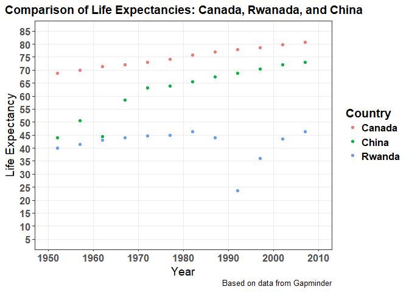
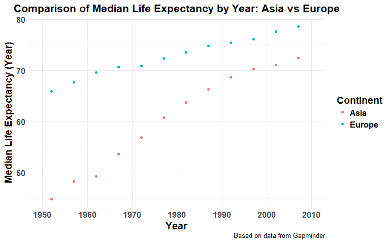
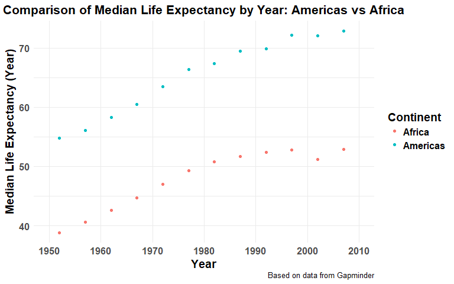

Homework 4 - Tidy data and joins
================
Hayden Scheiber -
07 October, 2017

[Return to Main Page](https://github.com/HScheiber/STAT545-hw-Scheiber-Hayden/blob/master/README.md)

[Return to Homework 4 Landing Page](README.md)

------------------------------------------------------------------------

-   [General data reshaping and relationship to aggregation](#general-data-reshaping-and-relationship-to-aggregation)
    1.  [Make a tibble with one row per year and columns for life expectancy for two or more countries](#make-a-tibble-with-one-row-per-year-and-columns-for-life-expectancy-for-two-or-more-countries)
    2.  [Compute some measure of life expectancy for all possible combinations of continent and year](#compute-some-measure-of-life-expectancy-for-all-possible-combinations-of-continent-and-year)
    3.  [Take a tibble with 24 rows: 2 per year, and reshape it so you have one row per year](#take-a-tibble-with-24-rows-2-per-year-and-reshape-it-so-you-have-one-row-per-year)
-   [Join, merge, look up](#join-merge-look-up)
    1.  [Create a second data frame, complementary to Gapminder. Join this with part of Gapminder](#create-a-second-data-frame-complementary-to-gapminder-join-this-with-part-of-gapminder)

------------------------------------------------------------------------

Welcome! This is the data wrangling and reshaping skills development, as part of STAT 545 assignment 4.

First we need to load the `gapminder` dataset and the `tidyverse` package, as well as `knitr` for nicer table outputs. I included the `reshape2` library to compare the functions available there with those available in the `tidyverse`. I use `readr` to help import a comma separated data file.

``` r
suppressPackageStartupMessages(library(gapminder))
suppressPackageStartupMessages(library(tidyverse))
suppressPackageStartupMessages(library(knitr))
suppressPackageStartupMessages(library(reshape2))
suppressPackageStartupMessages(library(readr))
```

General data reshaping and relationship to aggregation
------------------------------------------------------

### Make a tibble with one row per year and columns for life expectancy for two or more countries

<a href="#top">Back to top</a>

Let's compare life expectancy of *Canada*, *Rwanada*, and *China*. I begin by selecting data only from those countries using `filter`. Then, using `select` I retain only the columns I want to keep. I'll show the first 5 rows of this table to give an idea of what it looks like.

``` r
data.selected.long <- gapminder %>%
        filter(country %in% c('Canada', 'Rwanda', 'China')) %>%
        select(country, year,lifeExp)

knitr::kable(head(data.selected.long,n=5))
```

| country |  year|  lifeExp|
|:--------|-----:|--------:|
| Canada  |  1952|    68.75|
| Canada  |  1957|    69.96|
| Canada  |  1962|    71.30|
| Canada  |  1967|    72.13|
| Canada  |  1972|    72.88|

Now it's time to reshape this data into the form we want. The `spread` function is used to convert a single column into multiple columns. This is useful for our *country* column because there are only three values present there, which will become the three new columns in the reshaped dataframe.

``` r
data.selected.wide <- data.selected.long %>%
        spread(country,lifeExp) 

knitr::kable(data.selected.wide,col.names = 
        c('Year','Life Expectancy in Canada (Years)', 
        'Life Expectancy in China (Years)', 
        'Life Expectancy in Rwanda (Years)'),
        align = 'c',
        caption = 'Based on data from Gapminder',
        format = 'markdown')
```

<table style="width:100%;">
<colgroup>
<col width="6%" />
<col width="31%" />
<col width="30%" />
<col width="31%" />
</colgroup>
<thead>
<tr class="header">
<th align="center">Year</th>
<th align="center">Life Expectancy in Canada (Years)</th>
<th align="center">Life Expectancy in China (Years)</th>
<th align="center">Life Expectancy in Rwanda (Years)</th>
</tr>
</thead>
<tbody>
<tr class="odd">
<td align="center">1952</td>
<td align="center">68.750</td>
<td align="center">44.00000</td>
<td align="center">40.000</td>
</tr>
<tr class="even">
<td align="center">1957</td>
<td align="center">69.960</td>
<td align="center">50.54896</td>
<td align="center">41.500</td>
</tr>
<tr class="odd">
<td align="center">1962</td>
<td align="center">71.300</td>
<td align="center">44.50136</td>
<td align="center">43.000</td>
</tr>
<tr class="even">
<td align="center">1967</td>
<td align="center">72.130</td>
<td align="center">58.38112</td>
<td align="center">44.100</td>
</tr>
<tr class="odd">
<td align="center">1972</td>
<td align="center">72.880</td>
<td align="center">63.11888</td>
<td align="center">44.600</td>
</tr>
<tr class="even">
<td align="center">1977</td>
<td align="center">74.210</td>
<td align="center">63.96736</td>
<td align="center">45.000</td>
</tr>
<tr class="odd">
<td align="center">1982</td>
<td align="center">75.760</td>
<td align="center">65.52500</td>
<td align="center">46.218</td>
</tr>
<tr class="even">
<td align="center">1987</td>
<td align="center">76.860</td>
<td align="center">67.27400</td>
<td align="center">44.020</td>
</tr>
<tr class="odd">
<td align="center">1992</td>
<td align="center">77.950</td>
<td align="center">68.69000</td>
<td align="center">23.599</td>
</tr>
<tr class="even">
<td align="center">1997</td>
<td align="center">78.610</td>
<td align="center">70.42600</td>
<td align="center">36.087</td>
</tr>
<tr class="odd">
<td align="center">2002</td>
<td align="center">79.770</td>
<td align="center">72.02800</td>
<td align="center">43.413</td>
</tr>
<tr class="even">
<td align="center">2007</td>
<td align="center">80.653</td>
<td align="center">72.96100</td>
<td align="center">46.242</td>
</tr>
</tbody>
</table>

I found that it was easier to use the long format to make a scatterplot comparison of the selected country's life expectancies vs year.

``` r
data.selected.long %>%
  ggplot(aes(x = year, y = lifeExp, colour=country)) + 
  geom_point() +
  scale_colour_discrete("Country") +
  scale_x_continuous(breaks = seq(1950, 2010, 10),
      labels = as.character(seq(1950, 2010, 10)),
      limits = c(1950, 2010),
      minor_breaks = NULL) +
  scale_y_continuous(breaks = seq(0, 85, 5),
      labels = as.character(seq(0, 85, 5)),
      limits = c(5, 85),
      minor_breaks = NULL) +
  theme_bw() + # black and white theme
  theme(axis.title = element_text(size=14),
      strip.text = element_text(size=14, face="bold"),
      plot.title = element_text(size=14, face="bold",hjust = 0.49),
      axis.text.x = element_text(size=12,face ="bold"),
      axis.text.y = element_text(size=12,face ="bold"),
      legend.title = element_text(size=14, face ="bold"),
      legend.text = element_text(size=12, face ="bold")) +
  labs(x = "Year", 
      y = "Life Expectancy",
      title = "Comparison of Life Expectancies: Canada, Rwanada, and China",
      caption = "Based on data from Gapminder")
```



### Compute some measure of life expectancy for all possible combinations of continent and year

<a href="#top">Back to top</a>

In this section, I have decided that I will compute the median life expectancy for each continent at each year.

``` r
data.lifeExp.wide <- gapminder %>%
        group_by(continent, year) %>%
        mutate(lifeExp.median = median(lifeExp)) %>%
        select(continent, year, lifeExp.median) %>%
        unique() %>%
        spread(continent,lifeExp.median)

knitr::kable(data.lifeExp.wide,col.names = 
        c('Year','Africa', 
        'Americas', 
        'Asia', 
        'Europe', 
        'Oceania'),
        align = 'c',
        format = 'html', 
        caption = "<h4>Median Life Expectancy by Continent (Years)</h4>")
```

<table>
<caption>
<h4>
Median Life Expectancy by Continent (Years)
</h4>
</caption>
<thead>
<tr>
<th style="text-align:center;">
Year
</th>
<th style="text-align:center;">
Africa
</th>
<th style="text-align:center;">
Americas
</th>
<th style="text-align:center;">
Asia
</th>
<th style="text-align:center;">
Europe
</th>
<th style="text-align:center;">
Oceania
</th>
</tr>
</thead>
<tbody>
<tr>
<td style="text-align:center;">
1952
</td>
<td style="text-align:center;">
38.8330
</td>
<td style="text-align:center;">
54.745
</td>
<td style="text-align:center;">
44.869
</td>
<td style="text-align:center;">
65.9000
</td>
<td style="text-align:center;">
69.2550
</td>
</tr>
<tr>
<td style="text-align:center;">
1957
</td>
<td style="text-align:center;">
40.5925
</td>
<td style="text-align:center;">
56.074
</td>
<td style="text-align:center;">
48.284
</td>
<td style="text-align:center;">
67.6500
</td>
<td style="text-align:center;">
70.2950
</td>
</tr>
<tr>
<td style="text-align:center;">
1962
</td>
<td style="text-align:center;">
42.6305
</td>
<td style="text-align:center;">
58.299
</td>
<td style="text-align:center;">
49.325
</td>
<td style="text-align:center;">
69.5250
</td>
<td style="text-align:center;">
71.0850
</td>
</tr>
<tr>
<td style="text-align:center;">
1967
</td>
<td style="text-align:center;">
44.6985
</td>
<td style="text-align:center;">
60.523
</td>
<td style="text-align:center;">
53.655
</td>
<td style="text-align:center;">
70.6100
</td>
<td style="text-align:center;">
71.3100
</td>
</tr>
<tr>
<td style="text-align:center;">
1972
</td>
<td style="text-align:center;">
47.0315
</td>
<td style="text-align:center;">
63.441
</td>
<td style="text-align:center;">
56.950
</td>
<td style="text-align:center;">
70.8850
</td>
<td style="text-align:center;">
71.9100
</td>
</tr>
<tr>
<td style="text-align:center;">
1977
</td>
<td style="text-align:center;">
49.2725
</td>
<td style="text-align:center;">
66.353
</td>
<td style="text-align:center;">
60.765
</td>
<td style="text-align:center;">
72.3350
</td>
<td style="text-align:center;">
72.8550
</td>
</tr>
<tr>
<td style="text-align:center;">
1982
</td>
<td style="text-align:center;">
50.7560
</td>
<td style="text-align:center;">
67.405
</td>
<td style="text-align:center;">
63.739
</td>
<td style="text-align:center;">
73.4900
</td>
<td style="text-align:center;">
74.2900
</td>
</tr>
<tr>
<td style="text-align:center;">
1987
</td>
<td style="text-align:center;">
51.6395
</td>
<td style="text-align:center;">
69.498
</td>
<td style="text-align:center;">
66.295
</td>
<td style="text-align:center;">
74.8150
</td>
<td style="text-align:center;">
75.3200
</td>
</tr>
<tr>
<td style="text-align:center;">
1992
</td>
<td style="text-align:center;">
52.4290
</td>
<td style="text-align:center;">
69.862
</td>
<td style="text-align:center;">
68.690
</td>
<td style="text-align:center;">
75.4510
</td>
<td style="text-align:center;">
76.9450
</td>
</tr>
<tr>
<td style="text-align:center;">
1997
</td>
<td style="text-align:center;">
52.7590
</td>
<td style="text-align:center;">
72.146
</td>
<td style="text-align:center;">
70.265
</td>
<td style="text-align:center;">
76.1160
</td>
<td style="text-align:center;">
78.1900
</td>
</tr>
<tr>
<td style="text-align:center;">
2002
</td>
<td style="text-align:center;">
51.2355
</td>
<td style="text-align:center;">
72.047
</td>
<td style="text-align:center;">
71.028
</td>
<td style="text-align:center;">
77.5365
</td>
<td style="text-align:center;">
79.7400
</td>
</tr>
<tr>
<td style="text-align:center;">
2007
</td>
<td style="text-align:center;">
52.9265
</td>
<td style="text-align:center;">
72.899
</td>
<td style="text-align:center;">
72.396
</td>
<td style="text-align:center;">
78.6085
</td>
<td style="text-align:center;">
80.7195
</td>
</tr>
</tbody>
</table>
To exchange columns for rows is very easy in R. Just use the transpose function `t()`.

``` r
data.lifeExp.wide.t <- t(data.lifeExp.wide)
  
# This step forces the years to be formatted as integers instead of floating point numbers
data.lifeExp.wide.t.table <- rbind(formatC(data.lifeExp.wide.t[1,],format="d"),
        data.lifeExp.wide.t[-1,])

knitr::kable(data.lifeExp.wide.t.table, 
        col.names = NULL,
        align = 'c',
        format = 'html', 
        caption = "<h4>Median Life Expectancy by Continent (Years)</h4>")
```

<table>
<caption>
<h4>
Median Life Expectancy by Continent (Years)
</h4>
</caption>
<tbody>
<tr>
<td style="text-align:left;">
</td>
<td style="text-align:center;">
1952
</td>
<td style="text-align:center;">
1957
</td>
<td style="text-align:center;">
1962
</td>
<td style="text-align:center;">
1967
</td>
<td style="text-align:center;">
1972
</td>
<td style="text-align:center;">
1977
</td>
<td style="text-align:center;">
1982
</td>
<td style="text-align:center;">
1987
</td>
<td style="text-align:center;">
1992
</td>
<td style="text-align:center;">
1997
</td>
<td style="text-align:center;">
2002
</td>
<td style="text-align:center;">
2007
</td>
</tr>
<tr>
<td style="text-align:left;">
Africa
</td>
<td style="text-align:center;">
38.833
</td>
<td style="text-align:center;">
40.5925
</td>
<td style="text-align:center;">
42.6305
</td>
<td style="text-align:center;">
44.6985
</td>
<td style="text-align:center;">
47.0315
</td>
<td style="text-align:center;">
49.2725
</td>
<td style="text-align:center;">
50.756
</td>
<td style="text-align:center;">
51.6395
</td>
<td style="text-align:center;">
52.429
</td>
<td style="text-align:center;">
52.759
</td>
<td style="text-align:center;">
51.2355
</td>
<td style="text-align:center;">
52.9265
</td>
</tr>
<tr>
<td style="text-align:left;">
Americas
</td>
<td style="text-align:center;">
54.745
</td>
<td style="text-align:center;">
56.074
</td>
<td style="text-align:center;">
58.299
</td>
<td style="text-align:center;">
60.523
</td>
<td style="text-align:center;">
63.441
</td>
<td style="text-align:center;">
66.353
</td>
<td style="text-align:center;">
67.405
</td>
<td style="text-align:center;">
69.498
</td>
<td style="text-align:center;">
69.862
</td>
<td style="text-align:center;">
72.146
</td>
<td style="text-align:center;">
72.047
</td>
<td style="text-align:center;">
72.899
</td>
</tr>
<tr>
<td style="text-align:left;">
Asia
</td>
<td style="text-align:center;">
44.869
</td>
<td style="text-align:center;">
48.284
</td>
<td style="text-align:center;">
49.325
</td>
<td style="text-align:center;">
53.655
</td>
<td style="text-align:center;">
56.95
</td>
<td style="text-align:center;">
60.765
</td>
<td style="text-align:center;">
63.739
</td>
<td style="text-align:center;">
66.295
</td>
<td style="text-align:center;">
68.69
</td>
<td style="text-align:center;">
70.265
</td>
<td style="text-align:center;">
71.028
</td>
<td style="text-align:center;">
72.396
</td>
</tr>
<tr>
<td style="text-align:left;">
Europe
</td>
<td style="text-align:center;">
65.9
</td>
<td style="text-align:center;">
67.65
</td>
<td style="text-align:center;">
69.525
</td>
<td style="text-align:center;">
70.61
</td>
<td style="text-align:center;">
70.885
</td>
<td style="text-align:center;">
72.335
</td>
<td style="text-align:center;">
73.49
</td>
<td style="text-align:center;">
74.815
</td>
<td style="text-align:center;">
75.451
</td>
<td style="text-align:center;">
76.116
</td>
<td style="text-align:center;">
77.5365
</td>
<td style="text-align:center;">
78.6085
</td>
</tr>
<tr>
<td style="text-align:left;">
Oceania
</td>
<td style="text-align:center;">
69.255
</td>
<td style="text-align:center;">
70.295
</td>
<td style="text-align:center;">
71.085
</td>
<td style="text-align:center;">
71.31
</td>
<td style="text-align:center;">
71.91
</td>
<td style="text-align:center;">
72.855
</td>
<td style="text-align:center;">
74.29
</td>
<td style="text-align:center;">
75.32
</td>
<td style="text-align:center;">
76.945
</td>
<td style="text-align:center;">
78.19
</td>
<td style="text-align:center;">
79.74
</td>
<td style="text-align:center;">
80.7195
</td>
</tr>
</tbody>
</table>
This type of data format is human readable, but it isn't the best format for `ggplot`. The only types of plots I could *maybe* see being easier with these formats are comparisons between different years or different continents. Even then, it seems to make colouring points by continent more awkward.

``` r
ggplot(data.lifeExp.wide,aes(x = year)) +
  geom_point(aes(y=Europe, colour='Europe')) +
  geom_point(aes(y=Asia, colour='Asia')) +
  scale_x_continuous(breaks = seq(1950, 2010, 10),
    labels = as.character(seq(1950, 2010, 10)),
    limits = c(1950, 2010),
    minor_breaks = NULL) +
  scale_colour_discrete(name = "Continent") +
  theme_minimal() +
  theme(axis.text.x = element_text(size=12,face ="bold"),
    axis.text.y = element_text(size=12,face ="bold"),
    plot.title = element_text(size=16,face ="bold",hjust = 0.5),
    axis.title = element_text(size=14, face ="bold"),
    legend.title = element_text(size=14, face ="bold"),
    legend.text = element_text(size=12, face ="bold")) +
  labs(x = "Year", 
    y = "Median Life Expectancy (Year)",
    title = "Comparison of Median Life Expectancy by Year: Asia vs Europe",
    caption = "Based on data from Gapminder")
```



If we use data in long format, as below, only a single layer of `geom_point` is required, but I also have to `filter` the data first. I think this method is better simply because of the colour aesthetic, which automatically maps to continent. In the previous example I had to manually map it, which just felt wrong.

``` r
# Same process as before, but without spread
data.lifeExp.long <- gapminder %>%
  group_by(continent, year) %>%
  mutate(lifeExp.median = median(lifeExp)) %>%
  select(continent, year, lifeExp.median) %>%
  unique()

data.lifeExp.long %>%
  filter(continent %in% c('Americas','Africa')) %>%
  ggplot(aes(x = year, y = lifeExp.median, colour = continent)) +
  geom_point() +
  scale_x_continuous(breaks = seq(1950, 2010, 10),
    labels = as.character(seq(1950, 2010, 10)),
    limits = c(1950, 2010),
    minor_breaks = NULL) +
  scale_colour_discrete(name = "Continent") +
  theme_minimal() +
  theme(axis.text.x = element_text(size=12,face ="bold"),
    axis.text.y = element_text(size=12,face ="bold"),
    plot.title = element_text(size=16,face ="bold",hjust = 0.5),
    axis.title = element_text(size=14, face ="bold"),
    legend.title = element_text(size=14, face ="bold"),
    legend.text = element_text(size=12, face ="bold")) +
  labs(x = "Year", 
    y = "Median Life Expectancy (Year)",
    title = "Comparison of Median Life Expectancy by Year: Americas vs Africa",
    caption = "Based on data from Gapminder")
```



### Take a tibble with 24 rows: 2 per year, and reshape it so you have one row per year

<a href="#top">Back to top</a>

For this, we start with the tibble created [here](http://stat545.com/block010_dplyr-end-single-table.html#window-functions "Window Functions").

``` r
data.lifeExp.Asia <- gapminder %>%
  filter(continent == "Asia") %>%
  select(year, country, lifeExp) %>%
  group_by(year) %>%
  filter(min_rank(desc(lifeExp)) < 2 | min_rank(lifeExp) < 2) %>% 
  arrange(year)

knitr::kable(data.lifeExp.Asia, 
  col.names = c('Year','Country','Life Expectancy (Years)'),
  align = 'c',
  format = 'html', 
  caption = "<h4>Highest and Lowest Life Expectancy by Year in Asia</h4>")
```

<table>
<caption>
<h4>
Highest and Lowest Life Expectancy by Year in Asia
</h4>
</caption>
<thead>
<tr>
<th style="text-align:center;">
Year
</th>
<th style="text-align:center;">
Country
</th>
<th style="text-align:center;">
Life Expectancy (Years)
</th>
</tr>
</thead>
<tbody>
<tr>
<td style="text-align:center;">
1952
</td>
<td style="text-align:center;">
Afghanistan
</td>
<td style="text-align:center;">
28.801
</td>
</tr>
<tr>
<td style="text-align:center;">
1952
</td>
<td style="text-align:center;">
Israel
</td>
<td style="text-align:center;">
65.390
</td>
</tr>
<tr>
<td style="text-align:center;">
1957
</td>
<td style="text-align:center;">
Afghanistan
</td>
<td style="text-align:center;">
30.332
</td>
</tr>
<tr>
<td style="text-align:center;">
1957
</td>
<td style="text-align:center;">
Israel
</td>
<td style="text-align:center;">
67.840
</td>
</tr>
<tr>
<td style="text-align:center;">
1962
</td>
<td style="text-align:center;">
Afghanistan
</td>
<td style="text-align:center;">
31.997
</td>
</tr>
<tr>
<td style="text-align:center;">
1962
</td>
<td style="text-align:center;">
Israel
</td>
<td style="text-align:center;">
69.390
</td>
</tr>
<tr>
<td style="text-align:center;">
1967
</td>
<td style="text-align:center;">
Afghanistan
</td>
<td style="text-align:center;">
34.020
</td>
</tr>
<tr>
<td style="text-align:center;">
1967
</td>
<td style="text-align:center;">
Japan
</td>
<td style="text-align:center;">
71.430
</td>
</tr>
<tr>
<td style="text-align:center;">
1972
</td>
<td style="text-align:center;">
Afghanistan
</td>
<td style="text-align:center;">
36.088
</td>
</tr>
<tr>
<td style="text-align:center;">
1972
</td>
<td style="text-align:center;">
Japan
</td>
<td style="text-align:center;">
73.420
</td>
</tr>
<tr>
<td style="text-align:center;">
1977
</td>
<td style="text-align:center;">
Cambodia
</td>
<td style="text-align:center;">
31.220
</td>
</tr>
<tr>
<td style="text-align:center;">
1977
</td>
<td style="text-align:center;">
Japan
</td>
<td style="text-align:center;">
75.380
</td>
</tr>
<tr>
<td style="text-align:center;">
1982
</td>
<td style="text-align:center;">
Afghanistan
</td>
<td style="text-align:center;">
39.854
</td>
</tr>
<tr>
<td style="text-align:center;">
1982
</td>
<td style="text-align:center;">
Japan
</td>
<td style="text-align:center;">
77.110
</td>
</tr>
<tr>
<td style="text-align:center;">
1987
</td>
<td style="text-align:center;">
Afghanistan
</td>
<td style="text-align:center;">
40.822
</td>
</tr>
<tr>
<td style="text-align:center;">
1987
</td>
<td style="text-align:center;">
Japan
</td>
<td style="text-align:center;">
78.670
</td>
</tr>
<tr>
<td style="text-align:center;">
1992
</td>
<td style="text-align:center;">
Afghanistan
</td>
<td style="text-align:center;">
41.674
</td>
</tr>
<tr>
<td style="text-align:center;">
1992
</td>
<td style="text-align:center;">
Japan
</td>
<td style="text-align:center;">
79.360
</td>
</tr>
<tr>
<td style="text-align:center;">
1997
</td>
<td style="text-align:center;">
Afghanistan
</td>
<td style="text-align:center;">
41.763
</td>
</tr>
<tr>
<td style="text-align:center;">
1997
</td>
<td style="text-align:center;">
Japan
</td>
<td style="text-align:center;">
80.690
</td>
</tr>
<tr>
<td style="text-align:center;">
2002
</td>
<td style="text-align:center;">
Afghanistan
</td>
<td style="text-align:center;">
42.129
</td>
</tr>
<tr>
<td style="text-align:center;">
2002
</td>
<td style="text-align:center;">
Japan
</td>
<td style="text-align:center;">
82.000
</td>
</tr>
<tr>
<td style="text-align:center;">
2007
</td>
<td style="text-align:center;">
Afghanistan
</td>
<td style="text-align:center;">
43.828
</td>
</tr>
<tr>
<td style="text-align:center;">
2007
</td>
<td style="text-align:center;">
Japan
</td>
<td style="text-align:center;">
82.603
</td>
</tr>
</tbody>
</table>
I would like to reshape this data so that there is only one row per year. I think there is probably an easier way of doing this, but I found a way that worked! I added new columns that indicated the maximum and minimum life expectancy of each year group, then cut away the previous and removed the duplicates.

``` r
data.lifeExp.Asia.grouped <- data.lifeExp.Asia %>%
  group_by(year) %>%
  mutate(min.lifeExp = min(lifeExp), 
         max.lifeExp = max(lifeExp),
         min.lifeExp.Country = country[1], 
         max.lifeExp.Country = country[2]) %>%
  select(year, 
         min.lifeExp.Country,
         min.lifeExp,
         max.lifeExp.Country,
         max.lifeExp) %>%
  unique()

knitr::kable(data.lifeExp.Asia.grouped,
  col.names = c("Year", 
                "Country with Lowest Life Expectancy",
                "Life Expectancy (Years)",
                "Country with Highest Life Expectancy",
                "Life Expectancy (Years)"),
  align = 'c',
  format = 'html', 
  caption = "<h4>Highest and Lowest Life Expectancy by Year in Asia (Years)</h4>")
```

<table>
<caption>
<h4>
Highest and Lowest Life Expectancy by Year in Asia (Years)
</h4>
</caption>
<thead>
<tr>
<th style="text-align:center;">
Year
</th>
<th style="text-align:center;">
Country with Lowest Life Expectancy
</th>
<th style="text-align:center;">
Life Expectancy (Years)
</th>
<th style="text-align:center;">
Country with Highest Life Expectancy
</th>
<th style="text-align:center;">
Life Expectancy (Years)
</th>
</tr>
</thead>
<tbody>
<tr>
<td style="text-align:center;">
1952
</td>
<td style="text-align:center;">
Afghanistan
</td>
<td style="text-align:center;">
28.801
</td>
<td style="text-align:center;">
Israel
</td>
<td style="text-align:center;">
65.390
</td>
</tr>
<tr>
<td style="text-align:center;">
1957
</td>
<td style="text-align:center;">
Afghanistan
</td>
<td style="text-align:center;">
30.332
</td>
<td style="text-align:center;">
Israel
</td>
<td style="text-align:center;">
67.840
</td>
</tr>
<tr>
<td style="text-align:center;">
1962
</td>
<td style="text-align:center;">
Afghanistan
</td>
<td style="text-align:center;">
31.997
</td>
<td style="text-align:center;">
Israel
</td>
<td style="text-align:center;">
69.390
</td>
</tr>
<tr>
<td style="text-align:center;">
1967
</td>
<td style="text-align:center;">
Afghanistan
</td>
<td style="text-align:center;">
34.020
</td>
<td style="text-align:center;">
Japan
</td>
<td style="text-align:center;">
71.430
</td>
</tr>
<tr>
<td style="text-align:center;">
1972
</td>
<td style="text-align:center;">
Afghanistan
</td>
<td style="text-align:center;">
36.088
</td>
<td style="text-align:center;">
Japan
</td>
<td style="text-align:center;">
73.420
</td>
</tr>
<tr>
<td style="text-align:center;">
1977
</td>
<td style="text-align:center;">
Cambodia
</td>
<td style="text-align:center;">
31.220
</td>
<td style="text-align:center;">
Japan
</td>
<td style="text-align:center;">
75.380
</td>
</tr>
<tr>
<td style="text-align:center;">
1982
</td>
<td style="text-align:center;">
Afghanistan
</td>
<td style="text-align:center;">
39.854
</td>
<td style="text-align:center;">
Japan
</td>
<td style="text-align:center;">
77.110
</td>
</tr>
<tr>
<td style="text-align:center;">
1987
</td>
<td style="text-align:center;">
Afghanistan
</td>
<td style="text-align:center;">
40.822
</td>
<td style="text-align:center;">
Japan
</td>
<td style="text-align:center;">
78.670
</td>
</tr>
<tr>
<td style="text-align:center;">
1992
</td>
<td style="text-align:center;">
Afghanistan
</td>
<td style="text-align:center;">
41.674
</td>
<td style="text-align:center;">
Japan
</td>
<td style="text-align:center;">
79.360
</td>
</tr>
<tr>
<td style="text-align:center;">
1997
</td>
<td style="text-align:center;">
Afghanistan
</td>
<td style="text-align:center;">
41.763
</td>
<td style="text-align:center;">
Japan
</td>
<td style="text-align:center;">
80.690
</td>
</tr>
<tr>
<td style="text-align:center;">
2002
</td>
<td style="text-align:center;">
Afghanistan
</td>
<td style="text-align:center;">
42.129
</td>
<td style="text-align:center;">
Japan
</td>
<td style="text-align:center;">
82.000
</td>
</tr>
<tr>
<td style="text-align:center;">
2007
</td>
<td style="text-align:center;">
Afghanistan
</td>
<td style="text-align:center;">
43.828
</td>
<td style="text-align:center;">
Japan
</td>
<td style="text-align:center;">
82.603
</td>
</tr>
</tbody>
</table>

## Join, merge, look up

--------------------

### Create a second data frame, complementary to Gapminder. Join this with part of Gapminder

<a href="#top">Back to top</a>

For this section, I downloaded a list of energy consumption per capita for 1960 to 2016 from the [world bank](https://data.worldbank.org/indicator/EG.USE.PCAP.KG.OE). I saved it as a `.csv` file and import it with the following command. Let's have a look at it's structure.

``` r
data.energy <- read.csv("Energy_use.csv")

knitr::kable(head(data.energy), 
  align = 'c',
  format = 'html', 
  caption = "<h4>Energy Use in Kg of Oil Equivalent per Capita</h4>")
```

<table>
<caption>
<h4>
Energy Use in Kg of Oil Equivalent per Capita
</h4>
</caption>
<thead>
<tr>
<th style="text-align:center;">
ï..Country.Name
</th>
<th style="text-align:center;">
Country.Code
</th>
<th style="text-align:center;">
Indicator.Name
</th>
<th style="text-align:center;">
Indicator.Code
</th>
<th style="text-align:center;">
X1960
</th>
<th style="text-align:center;">
X1961
</th>
<th style="text-align:center;">
X1962
</th>
<th style="text-align:center;">
X1963
</th>
<th style="text-align:center;">
X1964
</th>
<th style="text-align:center;">
X1965
</th>
<th style="text-align:center;">
X1966
</th>
<th style="text-align:center;">
X1967
</th>
<th style="text-align:center;">
X1968
</th>
<th style="text-align:center;">
X1969
</th>
<th style="text-align:center;">
X1970
</th>
<th style="text-align:center;">
X1971
</th>
<th style="text-align:center;">
X1972
</th>
<th style="text-align:center;">
X1973
</th>
<th style="text-align:center;">
X1974
</th>
<th style="text-align:center;">
X1975
</th>
<th style="text-align:center;">
X1976
</th>
<th style="text-align:center;">
X1977
</th>
<th style="text-align:center;">
X1978
</th>
<th style="text-align:center;">
X1979
</th>
<th style="text-align:center;">
X1980
</th>
<th style="text-align:center;">
X1981
</th>
<th style="text-align:center;">
X1982
</th>
<th style="text-align:center;">
X1983
</th>
<th style="text-align:center;">
X1984
</th>
<th style="text-align:center;">
X1985
</th>
<th style="text-align:center;">
X1986
</th>
<th style="text-align:center;">
X1987
</th>
<th style="text-align:center;">
X1988
</th>
<th style="text-align:center;">
X1989
</th>
<th style="text-align:center;">
X1990
</th>
<th style="text-align:center;">
X1991
</th>
<th style="text-align:center;">
X1992
</th>
<th style="text-align:center;">
X1993
</th>
<th style="text-align:center;">
X1994
</th>
<th style="text-align:center;">
X1995
</th>
<th style="text-align:center;">
X1996
</th>
<th style="text-align:center;">
X1997
</th>
<th style="text-align:center;">
X1998
</th>
<th style="text-align:center;">
X1999
</th>
<th style="text-align:center;">
X2000
</th>
<th style="text-align:center;">
X2001
</th>
<th style="text-align:center;">
X2002
</th>
<th style="text-align:center;">
X2003
</th>
<th style="text-align:center;">
X2004
</th>
<th style="text-align:center;">
X2005
</th>
<th style="text-align:center;">
X2006
</th>
<th style="text-align:center;">
X2007
</th>
<th style="text-align:center;">
X2008
</th>
<th style="text-align:center;">
X2009
</th>
<th style="text-align:center;">
X2010
</th>
<th style="text-align:center;">
X2011
</th>
<th style="text-align:center;">
X2012
</th>
<th style="text-align:center;">
X2013
</th>
<th style="text-align:center;">
X2014
</th>
<th style="text-align:center;">
X2015
</th>
<th style="text-align:center;">
X2016
</th>
<th style="text-align:center;">
X
</th>
</tr>
</thead>
<tbody>
<tr>
<td style="text-align:center;">
Aruba
</td>
<td style="text-align:center;">
ABW
</td>
<td style="text-align:center;">
Energy use (kg of oil equivalent per capita)
</td>
<td style="text-align:center;">
EG.USE.PCAP.KG.OE
</td>
<td style="text-align:center;">
NA
</td>
<td style="text-align:center;">
NA
</td>
<td style="text-align:center;">
NA
</td>
<td style="text-align:center;">
NA
</td>
<td style="text-align:center;">
NA
</td>
<td style="text-align:center;">
NA
</td>
<td style="text-align:center;">
NA
</td>
<td style="text-align:center;">
NA
</td>
<td style="text-align:center;">
NA
</td>
<td style="text-align:center;">
NA
</td>
<td style="text-align:center;">
NA
</td>
<td style="text-align:center;">
NA
</td>
<td style="text-align:center;">
NA
</td>
<td style="text-align:center;">
NA
</td>
<td style="text-align:center;">
NA
</td>
<td style="text-align:center;">
NA
</td>
<td style="text-align:center;">
NA
</td>
<td style="text-align:center;">
NA
</td>
<td style="text-align:center;">
NA
</td>
<td style="text-align:center;">
NA
</td>
<td style="text-align:center;">
NA
</td>
<td style="text-align:center;">
NA
</td>
<td style="text-align:center;">
NA
</td>
<td style="text-align:center;">
NA
</td>
<td style="text-align:center;">
NA
</td>
<td style="text-align:center;">
NA
</td>
<td style="text-align:center;">
NA
</td>
<td style="text-align:center;">
NA
</td>
<td style="text-align:center;">
NA
</td>
<td style="text-align:center;">
NA
</td>
<td style="text-align:center;">
NA
</td>
<td style="text-align:center;">
NA
</td>
<td style="text-align:center;">
NA
</td>
<td style="text-align:center;">
NA
</td>
<td style="text-align:center;">
NA
</td>
<td style="text-align:center;">
NA
</td>
<td style="text-align:center;">
NA
</td>
<td style="text-align:center;">
NA
</td>
<td style="text-align:center;">
NA
</td>
<td style="text-align:center;">
NA
</td>
<td style="text-align:center;">
NA
</td>
<td style="text-align:center;">
NA
</td>
<td style="text-align:center;">
NA
</td>
<td style="text-align:center;">
NA
</td>
<td style="text-align:center;">
NA
</td>
<td style="text-align:center;">
NA
</td>
<td style="text-align:center;">
NA
</td>
<td style="text-align:center;">
NA
</td>
<td style="text-align:center;">
NA
</td>
<td style="text-align:center;">
NA
</td>
<td style="text-align:center;">
NA
</td>
<td style="text-align:center;">
NA
</td>
<td style="text-align:center;">
NA
</td>
<td style="text-align:center;">
NA
</td>
<td style="text-align:center;">
NA
</td>
<td style="text-align:center;">
NA
</td>
<td style="text-align:center;">
NA
</td>
<td style="text-align:center;">
NA
</td>
</tr>
<tr>
<td style="text-align:center;">
Afghanistan
</td>
<td style="text-align:center;">
AFG
</td>
<td style="text-align:center;">
Energy use (kg of oil equivalent per capita)
</td>
<td style="text-align:center;">
EG.USE.PCAP.KG.OE
</td>
<td style="text-align:center;">
NA
</td>
<td style="text-align:center;">
NA
</td>
<td style="text-align:center;">
NA
</td>
<td style="text-align:center;">
NA
</td>
<td style="text-align:center;">
NA
</td>
<td style="text-align:center;">
NA
</td>
<td style="text-align:center;">
NA
</td>
<td style="text-align:center;">
NA
</td>
<td style="text-align:center;">
NA
</td>
<td style="text-align:center;">
NA
</td>
<td style="text-align:center;">
NA
</td>
<td style="text-align:center;">
NA
</td>
<td style="text-align:center;">
NA
</td>
<td style="text-align:center;">
NA
</td>
<td style="text-align:center;">
NA
</td>
<td style="text-align:center;">
NA
</td>
<td style="text-align:center;">
NA
</td>
<td style="text-align:center;">
NA
</td>
<td style="text-align:center;">
NA
</td>
<td style="text-align:center;">
NA
</td>
<td style="text-align:center;">
NA
</td>
<td style="text-align:center;">
NA
</td>
<td style="text-align:center;">
NA
</td>
<td style="text-align:center;">
NA
</td>
<td style="text-align:center;">
NA
</td>
<td style="text-align:center;">
NA
</td>
<td style="text-align:center;">
NA
</td>
<td style="text-align:center;">
NA
</td>
<td style="text-align:center;">
NA
</td>
<td style="text-align:center;">
NA
</td>
<td style="text-align:center;">
NA
</td>
<td style="text-align:center;">
NA
</td>
<td style="text-align:center;">
NA
</td>
<td style="text-align:center;">
NA
</td>
<td style="text-align:center;">
NA
</td>
<td style="text-align:center;">
NA
</td>
<td style="text-align:center;">
NA
</td>
<td style="text-align:center;">
NA
</td>
<td style="text-align:center;">
NA
</td>
<td style="text-align:center;">
NA
</td>
<td style="text-align:center;">
NA
</td>
<td style="text-align:center;">
NA
</td>
<td style="text-align:center;">
NA
</td>
<td style="text-align:center;">
NA
</td>
<td style="text-align:center;">
NA
</td>
<td style="text-align:center;">
NA
</td>
<td style="text-align:center;">
NA
</td>
<td style="text-align:center;">
NA
</td>
<td style="text-align:center;">
NA
</td>
<td style="text-align:center;">
NA
</td>
<td style="text-align:center;">
NA
</td>
<td style="text-align:center;">
NA
</td>
<td style="text-align:center;">
NA
</td>
<td style="text-align:center;">
NA
</td>
<td style="text-align:center;">
NA
</td>
<td style="text-align:center;">
NA
</td>
<td style="text-align:center;">
NA
</td>
<td style="text-align:center;">
NA
</td>
</tr>
<tr>
<td style="text-align:center;">
Angola
</td>
<td style="text-align:center;">
AGO
</td>
<td style="text-align:center;">
Energy use (kg of oil equivalent per capita)
</td>
<td style="text-align:center;">
EG.USE.PCAP.KG.OE
</td>
<td style="text-align:center;">
NA
</td>
<td style="text-align:center;">
NA
</td>
<td style="text-align:center;">
NA
</td>
<td style="text-align:center;">
NA
</td>
<td style="text-align:center;">
NA
</td>
<td style="text-align:center;">
NA
</td>
<td style="text-align:center;">
NA
</td>
<td style="text-align:center;">
NA
</td>
<td style="text-align:center;">
NA
</td>
<td style="text-align:center;">
NA
</td>
<td style="text-align:center;">
NA
</td>
<td style="text-align:center;">
555.8826
</td>
<td style="text-align:center;">
584.3152
</td>
<td style="text-align:center;">
567.5612
</td>
<td style="text-align:center;">
564.5783
</td>
<td style="text-align:center;">
536.4042
</td>
<td style="text-align:center;">
515.4481
</td>
<td style="text-align:center;">
493.8022
</td>
<td style="text-align:center;">
527.3258
</td>
<td style="text-align:center;">
518.2229
</td>
<td style="text-align:center;">
510.9863
</td>
<td style="text-align:center;">
496.8536
</td>
<td style="text-align:center;">
472.8293
</td>
<td style="text-align:center;">
468.8811
</td>
<td style="text-align:center;">
457.7808
</td>
<td style="text-align:center;">
470.3735
</td>
<td style="text-align:center;">
462.1985
</td>
<td style="text-align:center;">
460.8183
</td>
<td style="text-align:center;">
467.2142
</td>
<td style="text-align:center;">
464.9752
</td>
<td style="text-align:center;">
483.3574
</td>
<td style="text-align:center;">
479.8715
</td>
<td style="text-align:center;">
467.1092
</td>
<td style="text-align:center;">
468.0538
</td>
<td style="text-align:center;">
459.4536
</td>
<td style="text-align:center;">
445.3262
</td>
<td style="text-align:center;">
445.3477
</td>
<td style="text-align:center;">
442.7813
</td>
<td style="text-align:center;">
429.8326
</td>
<td style="text-align:center;">
438.8703
</td>
<td style="text-align:center;">
437.3376
</td>
<td style="text-align:center;">
442.0004
</td>
<td style="text-align:center;">
446.9038
</td>
<td style="text-align:center;">
465.5403
</td>
<td style="text-align:center;">
462.1575
</td>
<td style="text-align:center;">
430.9351
</td>
<td style="text-align:center;">
456.2469
</td>
<td style="text-align:center;">
469.6202
</td>
<td style="text-align:center;">
490.5364
</td>
<td style="text-align:center;">
514.4114
</td>
<td style="text-align:center;">
520.6751
</td>
<td style="text-align:center;">
521.8258
</td>
<td style="text-align:center;">
552.6229
</td>
<td style="text-align:center;">
534.1191
</td>
<td style="text-align:center;">
545.0405
</td>
<td style="text-align:center;">
NA
</td>
<td style="text-align:center;">
NA
</td>
<td style="text-align:center;">
NA
</td>
</tr>
<tr>
<td style="text-align:center;">
Albania
</td>
<td style="text-align:center;">
ALB
</td>
<td style="text-align:center;">
Energy use (kg of oil equivalent per capita)
</td>
<td style="text-align:center;">
EG.USE.PCAP.KG.OE
</td>
<td style="text-align:center;">
NA
</td>
<td style="text-align:center;">
NA
</td>
<td style="text-align:center;">
NA
</td>
<td style="text-align:center;">
NA
</td>
<td style="text-align:center;">
NA
</td>
<td style="text-align:center;">
NA
</td>
<td style="text-align:center;">
NA
</td>
<td style="text-align:center;">
NA
</td>
<td style="text-align:center;">
NA
</td>
<td style="text-align:center;">
NA
</td>
<td style="text-align:center;">
NA
</td>
<td style="text-align:center;">
785.1615
</td>
<td style="text-align:center;">
865.5925
</td>
<td style="text-align:center;">
762.7254
</td>
<td style="text-align:center;">
776.9347
</td>
<td style="text-align:center;">
826.9521
</td>
<td style="text-align:center;">
890.9534
</td>
<td style="text-align:center;">
923.7289
</td>
<td style="text-align:center;">
1010.8192
</td>
<td style="text-align:center;">
864.1995
</td>
<td style="text-align:center;">
1149.5361
</td>
<td style="text-align:center;">
989.2001
</td>
<td style="text-align:center;">
966.6833
</td>
<td style="text-align:center;">
1000.1220
</td>
<td style="text-align:center;">
1018.2631
</td>
<td style="text-align:center;">
916.5552
</td>
<td style="text-align:center;">
963.9272
</td>
<td style="text-align:center;">
921.8930
</td>
<td style="text-align:center;">
927.7445
</td>
<td style="text-align:center;">
896.4378
</td>
<td style="text-align:center;">
813.2557
</td>
<td style="text-align:center;">
572.7818
</td>
<td style="text-align:center;">
418.2866
</td>
<td style="text-align:center;">
412.3789
</td>
<td style="text-align:center;">
441.2493
</td>
<td style="text-align:center;">
417.0348
</td>
<td style="text-align:center;">
447.8489
</td>
<td style="text-align:center;">
384.5950
</td>
<td style="text-align:center;">
426.6828
</td>
<td style="text-align:center;">
576.1836
</td>
<td style="text-align:center;">
580.4948
</td>
<td style="text-align:center;">
597.2653
</td>
<td style="text-align:center;">
660.0480
</td>
<td style="text-align:center;">
648.1684
</td>
<td style="text-align:center;">
715.4145
</td>
<td style="text-align:center;">
719.5844
</td>
<td style="text-align:center;">
706.8594
</td>
<td style="text-align:center;">
679.8618
</td>
<td style="text-align:center;">
710.7485
</td>
<td style="text-align:center;">
732.3167
</td>
<td style="text-align:center;">
729.1544
</td>
<td style="text-align:center;">
764.9686
</td>
<td style="text-align:center;">
687.8963
</td>
<td style="text-align:center;">
801.3300
</td>
<td style="text-align:center;">
808.4558
</td>
<td style="text-align:center;">
NA
</td>
<td style="text-align:center;">
NA
</td>
<td style="text-align:center;">
NA
</td>
</tr>
<tr>
<td style="text-align:center;">
Andorra
</td>
<td style="text-align:center;">
AND
</td>
<td style="text-align:center;">
Energy use (kg of oil equivalent per capita)
</td>
<td style="text-align:center;">
EG.USE.PCAP.KG.OE
</td>
<td style="text-align:center;">
NA
</td>
<td style="text-align:center;">
NA
</td>
<td style="text-align:center;">
NA
</td>
<td style="text-align:center;">
NA
</td>
<td style="text-align:center;">
NA
</td>
<td style="text-align:center;">
NA
</td>
<td style="text-align:center;">
NA
</td>
<td style="text-align:center;">
NA
</td>
<td style="text-align:center;">
NA
</td>
<td style="text-align:center;">
NA
</td>
<td style="text-align:center;">
NA
</td>
<td style="text-align:center;">
NA
</td>
<td style="text-align:center;">
NA
</td>
<td style="text-align:center;">
NA
</td>
<td style="text-align:center;">
NA
</td>
<td style="text-align:center;">
NA
</td>
<td style="text-align:center;">
NA
</td>
<td style="text-align:center;">
NA
</td>
<td style="text-align:center;">
NA
</td>
<td style="text-align:center;">
NA
</td>
<td style="text-align:center;">
NA
</td>
<td style="text-align:center;">
NA
</td>
<td style="text-align:center;">
NA
</td>
<td style="text-align:center;">
NA
</td>
<td style="text-align:center;">
NA
</td>
<td style="text-align:center;">
NA
</td>
<td style="text-align:center;">
NA
</td>
<td style="text-align:center;">
NA
</td>
<td style="text-align:center;">
NA
</td>
<td style="text-align:center;">
NA
</td>
<td style="text-align:center;">
NA
</td>
<td style="text-align:center;">
NA
</td>
<td style="text-align:center;">
NA
</td>
<td style="text-align:center;">
NA
</td>
<td style="text-align:center;">
NA
</td>
<td style="text-align:center;">
NA
</td>
<td style="text-align:center;">
NA
</td>
<td style="text-align:center;">
NA
</td>
<td style="text-align:center;">
NA
</td>
<td style="text-align:center;">
NA
</td>
<td style="text-align:center;">
NA
</td>
<td style="text-align:center;">
NA
</td>
<td style="text-align:center;">
NA
</td>
<td style="text-align:center;">
NA
</td>
<td style="text-align:center;">
NA
</td>
<td style="text-align:center;">
NA
</td>
<td style="text-align:center;">
NA
</td>
<td style="text-align:center;">
NA
</td>
<td style="text-align:center;">
NA
</td>
<td style="text-align:center;">
NA
</td>
<td style="text-align:center;">
NA
</td>
<td style="text-align:center;">
NA
</td>
<td style="text-align:center;">
NA
</td>
<td style="text-align:center;">
NA
</td>
<td style="text-align:center;">
NA
</td>
<td style="text-align:center;">
NA
</td>
<td style="text-align:center;">
NA
</td>
<td style="text-align:center;">
NA
</td>
</tr>
<tr>
<td style="text-align:center;">
Arab World
</td>
<td style="text-align:center;">
ARB
</td>
<td style="text-align:center;">
Energy use (kg of oil equivalent per capita)
</td>
<td style="text-align:center;">
EG.USE.PCAP.KG.OE
</td>
<td style="text-align:center;">
NA
</td>
<td style="text-align:center;">
NA
</td>
<td style="text-align:center;">
NA
</td>
<td style="text-align:center;">
NA
</td>
<td style="text-align:center;">
NA
</td>
<td style="text-align:center;">
NA
</td>
<td style="text-align:center;">
NA
</td>
<td style="text-align:center;">
NA
</td>
<td style="text-align:center;">
NA
</td>
<td style="text-align:center;">
NA
</td>
<td style="text-align:center;">
NA
</td>
<td style="text-align:center;">
406.1678
</td>
<td style="text-align:center;">
410.4821
</td>
<td style="text-align:center;">
440.5221
</td>
<td style="text-align:center;">
457.1755
</td>
<td style="text-align:center;">
481.3987
</td>
<td style="text-align:center;">
522.1277
</td>
<td style="text-align:center;">
558.3905
</td>
<td style="text-align:center;">
623.6959
</td>
<td style="text-align:center;">
724.8316
</td>
<td style="text-align:center;">
788.4030
</td>
<td style="text-align:center;">
880.3153
</td>
<td style="text-align:center;">
950.8273
</td>
<td style="text-align:center;">
993.7204
</td>
<td style="text-align:center;">
986.2326
</td>
<td style="text-align:center;">
1011.0255
</td>
<td style="text-align:center;">
1027.1002
</td>
<td style="text-align:center;">
1080.9201
</td>
<td style="text-align:center;">
1141.2954
</td>
<td style="text-align:center;">
1167.7726
</td>
<td style="text-align:center;">
1070.6197
</td>
<td style="text-align:center;">
1083.6925
</td>
<td style="text-align:center;">
1138.1892
</td>
<td style="text-align:center;">
1172.2285
</td>
<td style="text-align:center;">
1203.5922
</td>
<td style="text-align:center;">
1257.3779
</td>
<td style="text-align:center;">
1279.5050
</td>
<td style="text-align:center;">
1299.8090
</td>
<td style="text-align:center;">
1290.7673
</td>
<td style="text-align:center;">
1276.0132
</td>
<td style="text-align:center;">
1278.8408
</td>
<td style="text-align:center;">
1345.5626
</td>
<td style="text-align:center;">
1381.5320
</td>
<td style="text-align:center;">
1373.7458
</td>
<td style="text-align:center;">
1422.6147
</td>
<td style="text-align:center;">
1477.4704
</td>
<td style="text-align:center;">
1543.8137
</td>
<td style="text-align:center;">
1575.1605
</td>
<td style="text-align:center;">
1658.9650
</td>
<td style="text-align:center;">
1704.6123
</td>
<td style="text-align:center;">
1764.5284
</td>
<td style="text-align:center;">
1730.3434
</td>
<td style="text-align:center;">
1840.1761
</td>
<td style="text-align:center;">
1796.9440
</td>
<td style="text-align:center;">
1953.2867
</td>
<td style="text-align:center;">
NA
</td>
<td style="text-align:center;">
NA
</td>
<td style="text-align:center;">
NA
</td>
</tr>
</tbody>
</table>
There are a few things wrong with this data. To start with, I want to remove columns 2, 3, and 4. There's no data for 2016, so I'll remove that too. I also need to change the other headings so that they will match those in `gapminder`.

``` r
# Remove columns 2:4 plus the last column for 2016
data.energy <- data.energy %>%
  select(ï..Country.Name, num_range("X", 1960:2015))

# Rename the columns
names(data.energy) <- c("country",1960:2015)

knitr::kable(head(data.energy), 
  align = 'c',
  format = 'html', 
  caption = "<h4>Energy Use in Kg of Oil Equivalent per Capita</h4>")
```

<table>
<caption>
<h4>
Energy Use in Kg of Oil Equivalent per Capita
</h4>
</caption>
<thead>
<tr>
<th style="text-align:center;">
country
</th>
<th style="text-align:center;">
1960
</th>
<th style="text-align:center;">
1961
</th>
<th style="text-align:center;">
1962
</th>
<th style="text-align:center;">
1963
</th>
<th style="text-align:center;">
1964
</th>
<th style="text-align:center;">
1965
</th>
<th style="text-align:center;">
1966
</th>
<th style="text-align:center;">
1967
</th>
<th style="text-align:center;">
1968
</th>
<th style="text-align:center;">
1969
</th>
<th style="text-align:center;">
1970
</th>
<th style="text-align:center;">
1971
</th>
<th style="text-align:center;">
1972
</th>
<th style="text-align:center;">
1973
</th>
<th style="text-align:center;">
1974
</th>
<th style="text-align:center;">
1975
</th>
<th style="text-align:center;">
1976
</th>
<th style="text-align:center;">
1977
</th>
<th style="text-align:center;">
1978
</th>
<th style="text-align:center;">
1979
</th>
<th style="text-align:center;">
1980
</th>
<th style="text-align:center;">
1981
</th>
<th style="text-align:center;">
1982
</th>
<th style="text-align:center;">
1983
</th>
<th style="text-align:center;">
1984
</th>
<th style="text-align:center;">
1985
</th>
<th style="text-align:center;">
1986
</th>
<th style="text-align:center;">
1987
</th>
<th style="text-align:center;">
1988
</th>
<th style="text-align:center;">
1989
</th>
<th style="text-align:center;">
1990
</th>
<th style="text-align:center;">
1991
</th>
<th style="text-align:center;">
1992
</th>
<th style="text-align:center;">
1993
</th>
<th style="text-align:center;">
1994
</th>
<th style="text-align:center;">
1995
</th>
<th style="text-align:center;">
1996
</th>
<th style="text-align:center;">
1997
</th>
<th style="text-align:center;">
1998
</th>
<th style="text-align:center;">
1999
</th>
<th style="text-align:center;">
2000
</th>
<th style="text-align:center;">
2001
</th>
<th style="text-align:center;">
2002
</th>
<th style="text-align:center;">
2003
</th>
<th style="text-align:center;">
2004
</th>
<th style="text-align:center;">
2005
</th>
<th style="text-align:center;">
2006
</th>
<th style="text-align:center;">
2007
</th>
<th style="text-align:center;">
2008
</th>
<th style="text-align:center;">
2009
</th>
<th style="text-align:center;">
2010
</th>
<th style="text-align:center;">
2011
</th>
<th style="text-align:center;">
2012
</th>
<th style="text-align:center;">
2013
</th>
<th style="text-align:center;">
2014
</th>
<th style="text-align:center;">
2015
</th>
</tr>
</thead>
<tbody>
<tr>
<td style="text-align:center;">
Aruba
</td>
<td style="text-align:center;">
NA
</td>
<td style="text-align:center;">
NA
</td>
<td style="text-align:center;">
NA
</td>
<td style="text-align:center;">
NA
</td>
<td style="text-align:center;">
NA
</td>
<td style="text-align:center;">
NA
</td>
<td style="text-align:center;">
NA
</td>
<td style="text-align:center;">
NA
</td>
<td style="text-align:center;">
NA
</td>
<td style="text-align:center;">
NA
</td>
<td style="text-align:center;">
NA
</td>
<td style="text-align:center;">
NA
</td>
<td style="text-align:center;">
NA
</td>
<td style="text-align:center;">
NA
</td>
<td style="text-align:center;">
NA
</td>
<td style="text-align:center;">
NA
</td>
<td style="text-align:center;">
NA
</td>
<td style="text-align:center;">
NA
</td>
<td style="text-align:center;">
NA
</td>
<td style="text-align:center;">
NA
</td>
<td style="text-align:center;">
NA
</td>
<td style="text-align:center;">
NA
</td>
<td style="text-align:center;">
NA
</td>
<td style="text-align:center;">
NA
</td>
<td style="text-align:center;">
NA
</td>
<td style="text-align:center;">
NA
</td>
<td style="text-align:center;">
NA
</td>
<td style="text-align:center;">
NA
</td>
<td style="text-align:center;">
NA
</td>
<td style="text-align:center;">
NA
</td>
<td style="text-align:center;">
NA
</td>
<td style="text-align:center;">
NA
</td>
<td style="text-align:center;">
NA
</td>
<td style="text-align:center;">
NA
</td>
<td style="text-align:center;">
NA
</td>
<td style="text-align:center;">
NA
</td>
<td style="text-align:center;">
NA
</td>
<td style="text-align:center;">
NA
</td>
<td style="text-align:center;">
NA
</td>
<td style="text-align:center;">
NA
</td>
<td style="text-align:center;">
NA
</td>
<td style="text-align:center;">
NA
</td>
<td style="text-align:center;">
NA
</td>
<td style="text-align:center;">
NA
</td>
<td style="text-align:center;">
NA
</td>
<td style="text-align:center;">
NA
</td>
<td style="text-align:center;">
NA
</td>
<td style="text-align:center;">
NA
</td>
<td style="text-align:center;">
NA
</td>
<td style="text-align:center;">
NA
</td>
<td style="text-align:center;">
NA
</td>
<td style="text-align:center;">
NA
</td>
<td style="text-align:center;">
NA
</td>
<td style="text-align:center;">
NA
</td>
<td style="text-align:center;">
NA
</td>
<td style="text-align:center;">
NA
</td>
</tr>
<tr>
<td style="text-align:center;">
Afghanistan
</td>
<td style="text-align:center;">
NA
</td>
<td style="text-align:center;">
NA
</td>
<td style="text-align:center;">
NA
</td>
<td style="text-align:center;">
NA
</td>
<td style="text-align:center;">
NA
</td>
<td style="text-align:center;">
NA
</td>
<td style="text-align:center;">
NA
</td>
<td style="text-align:center;">
NA
</td>
<td style="text-align:center;">
NA
</td>
<td style="text-align:center;">
NA
</td>
<td style="text-align:center;">
NA
</td>
<td style="text-align:center;">
NA
</td>
<td style="text-align:center;">
NA
</td>
<td style="text-align:center;">
NA
</td>
<td style="text-align:center;">
NA
</td>
<td style="text-align:center;">
NA
</td>
<td style="text-align:center;">
NA
</td>
<td style="text-align:center;">
NA
</td>
<td style="text-align:center;">
NA
</td>
<td style="text-align:center;">
NA
</td>
<td style="text-align:center;">
NA
</td>
<td style="text-align:center;">
NA
</td>
<td style="text-align:center;">
NA
</td>
<td style="text-align:center;">
NA
</td>
<td style="text-align:center;">
NA
</td>
<td style="text-align:center;">
NA
</td>
<td style="text-align:center;">
NA
</td>
<td style="text-align:center;">
NA
</td>
<td style="text-align:center;">
NA
</td>
<td style="text-align:center;">
NA
</td>
<td style="text-align:center;">
NA
</td>
<td style="text-align:center;">
NA
</td>
<td style="text-align:center;">
NA
</td>
<td style="text-align:center;">
NA
</td>
<td style="text-align:center;">
NA
</td>
<td style="text-align:center;">
NA
</td>
<td style="text-align:center;">
NA
</td>
<td style="text-align:center;">
NA
</td>
<td style="text-align:center;">
NA
</td>
<td style="text-align:center;">
NA
</td>
<td style="text-align:center;">
NA
</td>
<td style="text-align:center;">
NA
</td>
<td style="text-align:center;">
NA
</td>
<td style="text-align:center;">
NA
</td>
<td style="text-align:center;">
NA
</td>
<td style="text-align:center;">
NA
</td>
<td style="text-align:center;">
NA
</td>
<td style="text-align:center;">
NA
</td>
<td style="text-align:center;">
NA
</td>
<td style="text-align:center;">
NA
</td>
<td style="text-align:center;">
NA
</td>
<td style="text-align:center;">
NA
</td>
<td style="text-align:center;">
NA
</td>
<td style="text-align:center;">
NA
</td>
<td style="text-align:center;">
NA
</td>
<td style="text-align:center;">
NA
</td>
</tr>
<tr>
<td style="text-align:center;">
Angola
</td>
<td style="text-align:center;">
NA
</td>
<td style="text-align:center;">
NA
</td>
<td style="text-align:center;">
NA
</td>
<td style="text-align:center;">
NA
</td>
<td style="text-align:center;">
NA
</td>
<td style="text-align:center;">
NA
</td>
<td style="text-align:center;">
NA
</td>
<td style="text-align:center;">
NA
</td>
<td style="text-align:center;">
NA
</td>
<td style="text-align:center;">
NA
</td>
<td style="text-align:center;">
NA
</td>
<td style="text-align:center;">
555.8826
</td>
<td style="text-align:center;">
584.3152
</td>
<td style="text-align:center;">
567.5612
</td>
<td style="text-align:center;">
564.5783
</td>
<td style="text-align:center;">
536.4042
</td>
<td style="text-align:center;">
515.4481
</td>
<td style="text-align:center;">
493.8022
</td>
<td style="text-align:center;">
527.3258
</td>
<td style="text-align:center;">
518.2229
</td>
<td style="text-align:center;">
510.9863
</td>
<td style="text-align:center;">
496.8536
</td>
<td style="text-align:center;">
472.8293
</td>
<td style="text-align:center;">
468.8811
</td>
<td style="text-align:center;">
457.7808
</td>
<td style="text-align:center;">
470.3735
</td>
<td style="text-align:center;">
462.1985
</td>
<td style="text-align:center;">
460.8183
</td>
<td style="text-align:center;">
467.2142
</td>
<td style="text-align:center;">
464.9752
</td>
<td style="text-align:center;">
483.3574
</td>
<td style="text-align:center;">
479.8715
</td>
<td style="text-align:center;">
467.1092
</td>
<td style="text-align:center;">
468.0538
</td>
<td style="text-align:center;">
459.4536
</td>
<td style="text-align:center;">
445.3262
</td>
<td style="text-align:center;">
445.3477
</td>
<td style="text-align:center;">
442.7813
</td>
<td style="text-align:center;">
429.8326
</td>
<td style="text-align:center;">
438.8703
</td>
<td style="text-align:center;">
437.3376
</td>
<td style="text-align:center;">
442.0004
</td>
<td style="text-align:center;">
446.9038
</td>
<td style="text-align:center;">
465.5403
</td>
<td style="text-align:center;">
462.1575
</td>
<td style="text-align:center;">
430.9351
</td>
<td style="text-align:center;">
456.2469
</td>
<td style="text-align:center;">
469.6202
</td>
<td style="text-align:center;">
490.5364
</td>
<td style="text-align:center;">
514.4114
</td>
<td style="text-align:center;">
520.6751
</td>
<td style="text-align:center;">
521.8258
</td>
<td style="text-align:center;">
552.6229
</td>
<td style="text-align:center;">
534.1191
</td>
<td style="text-align:center;">
545.0405
</td>
<td style="text-align:center;">
NA
</td>
</tr>
<tr>
<td style="text-align:center;">
Albania
</td>
<td style="text-align:center;">
NA
</td>
<td style="text-align:center;">
NA
</td>
<td style="text-align:center;">
NA
</td>
<td style="text-align:center;">
NA
</td>
<td style="text-align:center;">
NA
</td>
<td style="text-align:center;">
NA
</td>
<td style="text-align:center;">
NA
</td>
<td style="text-align:center;">
NA
</td>
<td style="text-align:center;">
NA
</td>
<td style="text-align:center;">
NA
</td>
<td style="text-align:center;">
NA
</td>
<td style="text-align:center;">
785.1615
</td>
<td style="text-align:center;">
865.5925
</td>
<td style="text-align:center;">
762.7254
</td>
<td style="text-align:center;">
776.9347
</td>
<td style="text-align:center;">
826.9521
</td>
<td style="text-align:center;">
890.9534
</td>
<td style="text-align:center;">
923.7289
</td>
<td style="text-align:center;">
1010.8192
</td>
<td style="text-align:center;">
864.1995
</td>
<td style="text-align:center;">
1149.5361
</td>
<td style="text-align:center;">
989.2001
</td>
<td style="text-align:center;">
966.6833
</td>
<td style="text-align:center;">
1000.1220
</td>
<td style="text-align:center;">
1018.2631
</td>
<td style="text-align:center;">
916.5552
</td>
<td style="text-align:center;">
963.9272
</td>
<td style="text-align:center;">
921.8930
</td>
<td style="text-align:center;">
927.7445
</td>
<td style="text-align:center;">
896.4378
</td>
<td style="text-align:center;">
813.2557
</td>
<td style="text-align:center;">
572.7818
</td>
<td style="text-align:center;">
418.2866
</td>
<td style="text-align:center;">
412.3789
</td>
<td style="text-align:center;">
441.2493
</td>
<td style="text-align:center;">
417.0348
</td>
<td style="text-align:center;">
447.8489
</td>
<td style="text-align:center;">
384.5950
</td>
<td style="text-align:center;">
426.6828
</td>
<td style="text-align:center;">
576.1836
</td>
<td style="text-align:center;">
580.4948
</td>
<td style="text-align:center;">
597.2653
</td>
<td style="text-align:center;">
660.0480
</td>
<td style="text-align:center;">
648.1684
</td>
<td style="text-align:center;">
715.4145
</td>
<td style="text-align:center;">
719.5844
</td>
<td style="text-align:center;">
706.8594
</td>
<td style="text-align:center;">
679.8618
</td>
<td style="text-align:center;">
710.7485
</td>
<td style="text-align:center;">
732.3167
</td>
<td style="text-align:center;">
729.1544
</td>
<td style="text-align:center;">
764.9686
</td>
<td style="text-align:center;">
687.8963
</td>
<td style="text-align:center;">
801.3300
</td>
<td style="text-align:center;">
808.4558
</td>
<td style="text-align:center;">
NA
</td>
</tr>
<tr>
<td style="text-align:center;">
Andorra
</td>
<td style="text-align:center;">
NA
</td>
<td style="text-align:center;">
NA
</td>
<td style="text-align:center;">
NA
</td>
<td style="text-align:center;">
NA
</td>
<td style="text-align:center;">
NA
</td>
<td style="text-align:center;">
NA
</td>
<td style="text-align:center;">
NA
</td>
<td style="text-align:center;">
NA
</td>
<td style="text-align:center;">
NA
</td>
<td style="text-align:center;">
NA
</td>
<td style="text-align:center;">
NA
</td>
<td style="text-align:center;">
NA
</td>
<td style="text-align:center;">
NA
</td>
<td style="text-align:center;">
NA
</td>
<td style="text-align:center;">
NA
</td>
<td style="text-align:center;">
NA
</td>
<td style="text-align:center;">
NA
</td>
<td style="text-align:center;">
NA
</td>
<td style="text-align:center;">
NA
</td>
<td style="text-align:center;">
NA
</td>
<td style="text-align:center;">
NA
</td>
<td style="text-align:center;">
NA
</td>
<td style="text-align:center;">
NA
</td>
<td style="text-align:center;">
NA
</td>
<td style="text-align:center;">
NA
</td>
<td style="text-align:center;">
NA
</td>
<td style="text-align:center;">
NA
</td>
<td style="text-align:center;">
NA
</td>
<td style="text-align:center;">
NA
</td>
<td style="text-align:center;">
NA
</td>
<td style="text-align:center;">
NA
</td>
<td style="text-align:center;">
NA
</td>
<td style="text-align:center;">
NA
</td>
<td style="text-align:center;">
NA
</td>
<td style="text-align:center;">
NA
</td>
<td style="text-align:center;">
NA
</td>
<td style="text-align:center;">
NA
</td>
<td style="text-align:center;">
NA
</td>
<td style="text-align:center;">
NA
</td>
<td style="text-align:center;">
NA
</td>
<td style="text-align:center;">
NA
</td>
<td style="text-align:center;">
NA
</td>
<td style="text-align:center;">
NA
</td>
<td style="text-align:center;">
NA
</td>
<td style="text-align:center;">
NA
</td>
<td style="text-align:center;">
NA
</td>
<td style="text-align:center;">
NA
</td>
<td style="text-align:center;">
NA
</td>
<td style="text-align:center;">
NA
</td>
<td style="text-align:center;">
NA
</td>
<td style="text-align:center;">
NA
</td>
<td style="text-align:center;">
NA
</td>
<td style="text-align:center;">
NA
</td>
<td style="text-align:center;">
NA
</td>
<td style="text-align:center;">
NA
</td>
<td style="text-align:center;">
NA
</td>
</tr>
<tr>
<td style="text-align:center;">
Arab World
</td>
<td style="text-align:center;">
NA
</td>
<td style="text-align:center;">
NA
</td>
<td style="text-align:center;">
NA
</td>
<td style="text-align:center;">
NA
</td>
<td style="text-align:center;">
NA
</td>
<td style="text-align:center;">
NA
</td>
<td style="text-align:center;">
NA
</td>
<td style="text-align:center;">
NA
</td>
<td style="text-align:center;">
NA
</td>
<td style="text-align:center;">
NA
</td>
<td style="text-align:center;">
NA
</td>
<td style="text-align:center;">
406.1678
</td>
<td style="text-align:center;">
410.4821
</td>
<td style="text-align:center;">
440.5221
</td>
<td style="text-align:center;">
457.1755
</td>
<td style="text-align:center;">
481.3987
</td>
<td style="text-align:center;">
522.1277
</td>
<td style="text-align:center;">
558.3905
</td>
<td style="text-align:center;">
623.6959
</td>
<td style="text-align:center;">
724.8316
</td>
<td style="text-align:center;">
788.4030
</td>
<td style="text-align:center;">
880.3153
</td>
<td style="text-align:center;">
950.8273
</td>
<td style="text-align:center;">
993.7204
</td>
<td style="text-align:center;">
986.2326
</td>
<td style="text-align:center;">
1011.0255
</td>
<td style="text-align:center;">
1027.1002
</td>
<td style="text-align:center;">
1080.9201
</td>
<td style="text-align:center;">
1141.2954
</td>
<td style="text-align:center;">
1167.7726
</td>
<td style="text-align:center;">
1070.6197
</td>
<td style="text-align:center;">
1083.6925
</td>
<td style="text-align:center;">
1138.1892
</td>
<td style="text-align:center;">
1172.2285
</td>
<td style="text-align:center;">
1203.5922
</td>
<td style="text-align:center;">
1257.3779
</td>
<td style="text-align:center;">
1279.5050
</td>
<td style="text-align:center;">
1299.8090
</td>
<td style="text-align:center;">
1290.7673
</td>
<td style="text-align:center;">
1276.0132
</td>
<td style="text-align:center;">
1278.8408
</td>
<td style="text-align:center;">
1345.5626
</td>
<td style="text-align:center;">
1381.5320
</td>
<td style="text-align:center;">
1373.7458
</td>
<td style="text-align:center;">
1422.6147
</td>
<td style="text-align:center;">
1477.4704
</td>
<td style="text-align:center;">
1543.8137
</td>
<td style="text-align:center;">
1575.1605
</td>
<td style="text-align:center;">
1658.9650
</td>
<td style="text-align:center;">
1704.6123
</td>
<td style="text-align:center;">
1764.5284
</td>
<td style="text-align:center;">
1730.3434
</td>
<td style="text-align:center;">
1840.1761
</td>
<td style="text-align:center;">
1796.9440
</td>
<td style="text-align:center;">
1953.2867
</td>
<td style="text-align:center;">
NA
</td>
</tr>
</tbody>
</table>
So now the data frame looks less ugly, but it still won't match up with `gapminder` as it is. We need to have the years consolidated into a single column, with countries repeated for each year. Looks like a job for `gather`. At this point I will also remove any missing data points, there's really no point in keeping them!

``` r
data.energy.long <- data.energy %>%
  gather(year, Energy.Use.Per.Capita, 2:ncol(data.energy)) %>%
  filter(!is.na(Energy.Use.Per.Capita))

# Need to have year column as numeric
data.energy.long$year <- as.numeric(data.energy.long$year)

knitr::kable(head(data.energy.long), 
  align = 'c',
  format = 'html', 
  caption = "<h4>Energy Use in Kg of Oil Equivalent per Capita</h4>")
```

<table>
<caption>
<h4>
Energy Use in Kg of Oil Equivalent per Capita
</h4>
</caption>
<thead>
<tr>
<th style="text-align:center;">
country
</th>
<th style="text-align:center;">
year
</th>
<th style="text-align:center;">
Energy.Use.Per.Capita
</th>
</tr>
</thead>
<tbody>
<tr>
<td style="text-align:center;">
Australia
</td>
<td style="text-align:center;">
1960
</td>
<td style="text-align:center;">
3063.554
</td>
</tr>
<tr>
<td style="text-align:center;">
Austria
</td>
<td style="text-align:center;">
1960
</td>
<td style="text-align:center;">
1546.261
</td>
</tr>
<tr>
<td style="text-align:center;">
Belgium
</td>
<td style="text-align:center;">
1960
</td>
<td style="text-align:center;">
2519.497
</td>
</tr>
<tr>
<td style="text-align:center;">
Canada
</td>
<td style="text-align:center;">
1960
</td>
<td style="text-align:center;">
4251.436
</td>
</tr>
<tr>
<td style="text-align:center;">
Switzerland
</td>
<td style="text-align:center;">
1960
</td>
<td style="text-align:center;">
1398.655
</td>
</tr>
<tr>
<td style="text-align:center;">
Germany
</td>
<td style="text-align:center;">
1960
</td>
<td style="text-align:center;">
1952.589
</td>
</tr>
</tbody>
</table>
Finally, the data frame is in the shape I needed! Let's try joining it with gapminder using the various `_join` functions.

#### Left join

I'll join this new data frame `data.energy.long` to gapminder using `left_join`. This type of join preserves all data in the first data frame (`gapminder` in this case) and adds new columns from the second data frame to matching rows. If there is no match for a row in the second data frame to the first, that data point will be excluded.

``` r
gapminder.energy.left <- left_join(gapminder,data.energy.long, by = c("country","year"))
```

    ## Warning: Column `country` joining factors with different levels, coercing
    ## to character vector

``` r
glimpse(gapminder.energy.left)
```

    ## Observations: 1,704
    ## Variables: 7
    ## $ country               <chr> "Afghanistan", "Afghanistan", "Afghanist...
    ## $ continent             <fctr> Asia, Asia, Asia, Asia, Asia, Asia, Asi...
    ## $ year                  <dbl> 1952, 1957, 1962, 1967, 1972, 1977, 1982...
    ## $ lifeExp               <dbl> 28.801, 30.332, 31.997, 34.020, 36.088, ...
    ## $ pop                   <int> 8425333, 9240934, 10267083, 11537966, 13...
    ## $ gdpPercap             <dbl> 779.4453, 820.8530, 853.1007, 836.1971, ...
    ## $ Energy.Use.Per.Capita <dbl> NA, NA, NA, NA, NA, NA, NA, NA, NA, NA, ...

The warning comes about because the `country` columns in `gapminder` and `data.energy.long` are not just a character vectors, but instead have associated numbers: They are class `factor`. The numbers from the matching countries do not necessarily match between these lists, resulting in a warning being thrown. We can convert the columns to character vectors with `as.character` to get rid of the warning.

``` r
my.gap <- gapminder
my.gap$country <- as.character(my.gap$country)
data.energy.long$country <- as.character(data.energy.long$country)

gapminder.energy.left <- left_join(my.gap,data.energy.long, by = c("country","year"))

glimpse(gapminder.energy.left)
```

    ## Observations: 1,704
    ## Variables: 7
    ## $ country               <chr> "Afghanistan", "Afghanistan", "Afghanist...
    ## $ continent             <fctr> Asia, Asia, Asia, Asia, Asia, Asia, Asi...
    ## $ year                  <dbl> 1952, 1957, 1962, 1967, 1972, 1977, 1982...
    ## $ lifeExp               <dbl> 28.801, 30.332, 31.997, 34.020, 36.088, ...
    ## $ pop                   <int> 8425333, 9240934, 10267083, 11537966, 13...
    ## $ gdpPercap             <dbl> 779.4453, 820.8530, 853.1007, 836.1971, ...
    ## $ Energy.Use.Per.Capita <dbl> NA, NA, NA, NA, NA, NA, NA, NA, NA, NA, ...

#### Right Join

Same as `left_join` but changed the arguments around. All of the observations of `data.energy.long,` are obtained

``` r
gapminder.energy.right <- right_join(my.gap,data.energy.long, by = c("country","year"))

glimpse(gapminder.energy.right)
```

    ## Observations: 7,884
    ## Variables: 7
    ## $ country               <chr> "Australia", "Austria", "Belgium", "Cana...
    ## $ continent             <fctr> NA, NA, NA, NA, NA, NA, NA, NA, NA, NA,...
    ## $ year                  <dbl> 1960, 1960, 1960, 1960, 1960, 1960, 1960...
    ## $ lifeExp               <dbl> NA, NA, NA, NA, NA, NA, NA, NA, NA, NA, ...
    ## $ pop                   <int> NA, NA, NA, NA, NA, NA, NA, NA, NA, NA, ...
    ## $ gdpPercap             <dbl> NA, NA, NA, NA, NA, NA, NA, NA, NA, NA, ...
    ## $ Energy.Use.Per.Capita <dbl> 3063.5543, 1546.2615, 2519.4973, 4251.43...

So now all data from `data.energy.long` has been retained, and columns from gapminder have been added. Data from gapminder has been kept where it matches the country and year in `data.energy.long`.

#### Inner Join

`inner_join` retains only data found in both sets. There should be no missing data points here.

``` r
gapminder.energy.inner <- inner_join(my.gap,data.energy.long, by = c("country","year"))

glimpse(gapminder.energy.inner)
```

    ## Observations: 880
    ## Variables: 7
    ## $ country               <chr> "Albania", "Albania", "Albania", "Albani...
    ## $ continent             <fctr> Europe, Europe, Europe, Europe, Europe,...
    ## $ year                  <dbl> 1972, 1977, 1982, 1987, 1992, 1997, 2002...
    ## $ lifeExp               <dbl> 67.690, 68.930, 70.420, 72.000, 71.581, ...
    ## $ pop                   <int> 2263554, 2509048, 2780097, 3075321, 3326...
    ## $ gdpPercap             <dbl> 3313.422, 3533.004, 3630.881, 3738.933, ...
    ## $ Energy.Use.Per.Capita <dbl> 865.5925, 923.7289, 966.6833, 921.8930, ...

#### Full Join

This function retains all data points from both data sets.

``` r
gapminder.energy.full <- full_join(my.gap,data.energy.long, by = c("country","year"))

glimpse(gapminder.energy.full)
```

    ## Observations: 8,708
    ## Variables: 7
    ## $ country               <chr> "Afghanistan", "Afghanistan", "Afghanist...
    ## $ continent             <fctr> Asia, Asia, Asia, Asia, Asia, Asia, Asi...
    ## $ year                  <dbl> 1952, 1957, 1962, 1967, 1972, 1977, 1982...
    ## $ lifeExp               <dbl> 28.801, 30.332, 31.997, 34.020, 36.088, ...
    ## $ pop                   <int> 8425333, 9240934, 10267083, 11537966, 13...
    ## $ gdpPercap             <dbl> 779.4453, 820.8530, 853.1007, 836.1971, ...
    ## $ Energy.Use.Per.Capita <dbl> NA, NA, NA, NA, NA, NA, NA, NA, NA, NA, ...

#### Semi Join

`semi_Join` is a way of filtering out the data in the first argument by keeping only the data points that have matches in the second argument. In this case, no `Energy.user.Per.Capita` columns are added.

``` r
gapminder.energy.semi <- semi_join(my.gap,data.energy.long, by = c("country","year"))

glimpse(gapminder.energy.semi)
```

    ## Observations: 880
    ## Variables: 6
    ## $ country   <chr> "Albania", "Albania", "Albania", "Albania", "Albania...
    ## $ continent <fctr> Europe, Europe, Europe, Europe, Europe, Europe, Eur...
    ## $ year      <int> 1972, 1977, 1982, 1987, 1992, 1997, 2002, 2007, 1972...
    ## $ lifeExp   <dbl> 67.690, 68.930, 70.420, 72.000, 71.581, 72.950, 75.6...
    ## $ pop       <int> 2263554, 2509048, 2780097, 3075321, 3326498, 3428038...
    ## $ gdpPercap <dbl> 3313.422, 3533.004, 3630.881, 3738.933, 2497.438, 31...

#### Anti Join

This is another joining function. It is the inverse of `semi_join` and keeps only data points in the first argument *without* matches in the second.

``` r
gapminder.energy.anti <- anti_join(my.gap,data.energy.long, by = c("country","year"))

glimpse(gapminder.energy.anti)
```

    ## Observations: 824
    ## Variables: 6
    ## $ country   <chr> "Afghanistan", "Afghanistan", "Afghanistan", "Afghan...
    ## $ continent <fctr> Asia, Asia, Asia, Asia, Asia, Asia, Asia, Asia, Asi...
    ## $ year      <int> 1952, 1957, 1962, 1967, 1972, 1977, 1982, 1987, 1992...
    ## $ lifeExp   <dbl> 28.801, 30.332, 31.997, 34.020, 36.088, 38.438, 39.8...
    ## $ pop       <int> 8425333, 9240934, 10267083, 11537966, 13079460, 1488...
    ## $ gdpPercap <dbl> 779.4453, 820.8530, 853.1007, 836.1971, 739.9811, 78...

<a href="#top">Back to top</a>
