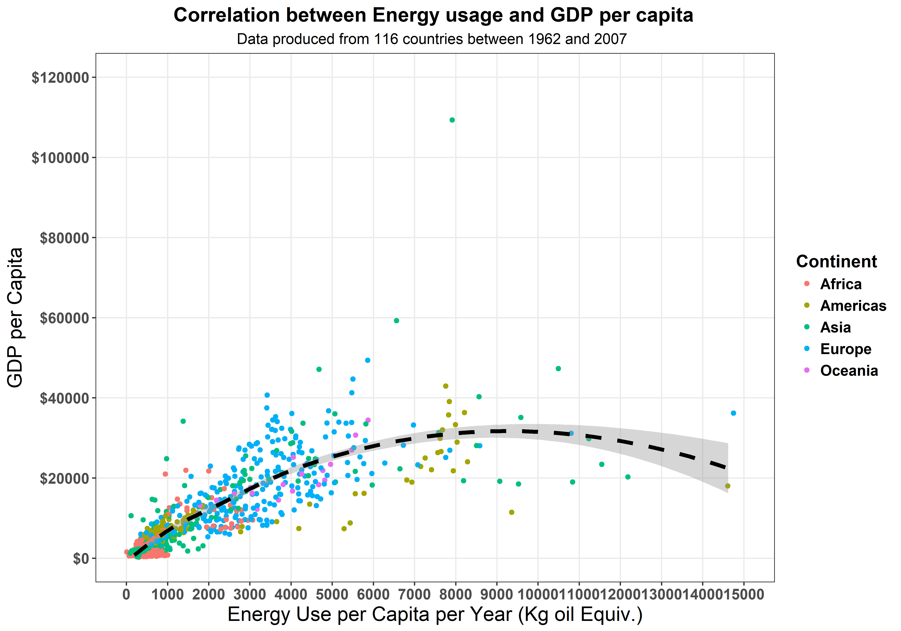

[Return to Main Page](https://github.com/HScheiber/STAT545-hw-Scheiber-Hayden/blob/master/README.md)

[Return to Homework 5 Landing Page](README.md)

---

- [Factor Management](#factor-management)
    1. [Goals](#goals)
    2. [Drop Oceania](#drop-oceania)
    3. [Reorder the levels of country or continent](#reorder-the-levels-of-country-or-continent)
- [File I/O](#file-io)
- [Visualization design](#visualization-design)
- [Writing Figures to File](#writing-figures-to-file)

---

Welcome! This is my attempt at further developing my data wrangling and reshaping skills, as part of STAT 545 assignment 5. A link to the assignment itself can be found [here](http://stat545.com/hw05_factor-figure-boss-repo-hygiene.html "STAT 545 Assignment 5").

---

Below are the packages that are used in the making of this assignment.
```{r warning = FALSE}
suppressPackageStartupMessages(library(gapminder))
suppressPackageStartupMessages(library(tidyverse))
suppressPackageStartupMessages(library(knitr))
suppressPackageStartupMessages(library(readr))
suppressPackageStartupMessages(library(forcats))
suppressPackageStartupMessages(library(gridExtra))
```

## Factor Management
<a href="#top">Back to top</a>

#### Goals
<a href="#top">Back to top</a>

- Define factor variables
- Drop factor / levels
- Reorder levels based on knowledge from data

For this part, I will work with the `gapminder` dataset.

#### Drop Oceania
<a href="#top">Back to top</a>

First, lets make sure that the `continent` variable is indeed a factor, using the `class` function. Then we can have a look at the levels associated it. This can easily be done using the function `levels`.

```{r}
class(gapminder$continent)
levels(gapminder$continent)
```

There are five levels, corresponding to the five unique continents which are contained in this variable. How many of the entries correspond to Oceania? How many don't?
```{r}
table(gapminder$continent)

table(gapminder$continent)[1:4] %>%
  sum()
```

So 24 entries are for the continent of Oceania, whereas the other 1680 rows correspond to other continents.

We can also look at the numeric values of the continent variable, which are mapped to the levels. Below I show the first 100 as an example.

```{r}
as.numeric(head(gapminder$continent,n=100))
```

So now we want to get rid of all the entries associated with Oceania, and remove it from the levels as well. My first attempt was to use the `filter` function.

```{r}
gap.rm.oceania <- gapminder %>%
  filter(continent != "Oceania")
  
table(gap.rm.oceania$continent)

length(gap.rm.oceania$continent)
```
  
Using `filter` does indeed remove the rows associated with Oceania, as only the 1680 other rows remain. However, the level `Oceania` is still present! There are simply no entries that point to it. As you might expect, there is an R function that can get rid of unused levels: `droplevels`.

```{r}
gap.rmlevel.oceania <- droplevels(gap.rm.oceania)

table(gap.rmlevel.oceania$continent)

length(gap.rmlevel.oceania$continent)
```

Another option for getting rid of unused levels is to use the `factor` function like so:

```{r}
gap.continent.rmlevel.oceania <- factor(gap.rm.oceania$continent)

table(gap.continent.rmlevel.oceania)

length(gap.continent.rmlevel.oceania)
```


#### Reorder the levels of country or continent
<a href="#top">Back to top</a>

Use the forcats package to change the order of the factor levels, based on a principled summary of one of the quantitative variables. Consider experimenting with a summary statistic beyond the most basic choice of the median.
 
For this question, I have decided to use the range of life expectancy for each country over the years on record as my summary statistic. I calculate this below and show the first 10 entries in descending order.
```{r}
gap.countries.LERange <- gapminder %>%
  group_by(country) %>%
  summarize(continent = unique(continent),
        lifeExp.Range = max(lifeExp) - min(lifeExp),
        pop.Range = max(pop) - min(pop),
        gdpPercap.Range = max(gdpPercap)-min(gdpPercap)) %>%
  arrange(desc(lifeExp.Range))
  
knitr::kable(head(gap.countries.LERange,n=10),col.names = 
        c('Country','Continent',
        'Life Expectancy (Years)',
        'Population',
        'GDP per capita'), 
        align = 'c',
        format = 'html', 
        caption = "<h4>Ranges in Life Expectancy, Population, and GDP per capita: 1952-2007</h4>")
```

Note that the numerical entries for the country factors have not changed after the above data manipulation, only their ordering has been changed. To show this, I'll include the numeric factors in the below table. 
```{r}
gap.countries.LERange %>%
  mutate(numeric.factor = as.numeric(country)) %>%
  select(country,numeric.factor,lifeExp.Range) %>%
  head(n=10) %>%
  knitr::kable(col.names = 
        c('Country','Factor','Life Expectancy Range (years)'), 
        align = 'c',
        format = 'html', 
        caption = "<h4>Numeric Factors are not Modified</h4>")
```

Just to show that these are really the same numeric labels as before, I'll output a few numeric labels directly from the original data frame.
```{r}
as.numeric(gapminder$country[gapminder$country == "Oman"]) %>%
  unique()
  
as.numeric(gapminder$country[gapminder$country == "Vietnam"]) %>%
  unique()
  
as.numeric(gapminder$country[gapminder$country == "Indonesia"]) %>%
  unique()
```

I want to order the factor numbers in the new dataset by life expectancy range. Since the entries are already ordered within the dataframe, I can use `forcats::fct_inorder()` to reorder the numerical entries of the factor by the order that they appear.
```{r}
gap.countries.LERange$country <- fct_inorder(gap.countries.LERange$country)

gap.countries.LERange %>%
  mutate(numeric.factor = as.numeric(country)) %>%
  select(country,numeric.factor,lifeExp.Range) %>%
  head(n=10) %>%
  knitr::kable(col.names = 
        c('Country','Factor','Life Expectancy Range (years)'), 
        align = 'c',
        format = 'html', 
        caption = "<h4>Numeric Factors Reordered</h4>")
```

So we see that the numeric factors for the `country` variable are now relabelled in order of decreasing life expectancy range!

Now that I have my factors in order, I want to save this data frame to file. Since this is just a demo, I'll save it to my temporary folder using a uniquely generated name with `tempfile`.
```{r}
tmp <- tempfile("gap_countries_LERange", fileext = ".csv")
write_csv(gap.countries.LERange,tmp)
```

It's easy to bring this data back to working memory with `read_csv`. I explicitly define the column types to avoid a warning message. Since the `.csv` file format doesn't preserve the factor indices, I also have to re-assign the `country` variable as a factor.
```{r}
col.type <- cols(
  country = col_character(),
  continent = col_character(),
  lifeExp.Range = col_double(),
  pop.Range = col_double(),
  gdpPercap.Range = col_double()
)

copied.data <- read_csv(tmp,col_types = col.type) 

copied.data$country <- fct_inorder(copied.data$country)

copied.data %>%
  mutate(numeric.factor = as.numeric(country)) %>%
  select(country,numeric.factor,lifeExp.Range) %>%
  head(n=10) %>%
  knitr::kable(col.names = 
        c('Country','Factor','Life Expectancy Range (years)'), 
        align = 'c',
        format = 'html', 
        caption = "<h4>Reloaded Data</h4>")
```

If I load without re-assigning `country` to a factor, then it is simply loaded as a string. This means `write_csv` saves factors as their labels, numeric indices are thrown out!
```{r}
copied.data.reloaded <- read_csv(tmp,col_types = col.type)

str(copied.data$country)
str(copied.data.reloaded$country)
```


## File I/O
<a href="#top">Back to top</a>

We just saw in the previous section that saving a file using `write_csv` destroys any information about factor indices. What if we want to save an R object exactly as it is in our working memory? This can be done with `saveRDS` and reloaded with `readRDS`. Let's give it a try with our modified data set. I'll once again use a temporary file name.

```{r}
tmp2 <- tempfile("gap_countries_LERange", fileext = ".rds")
saveRDS(gap.countries.LERange,tmp2)
```

Reloading it and comparing the structure before and after:
```{r}
copied.data.rds <- readRDS(tmp2)

str(copied.data.rds)
str(gap.countries.LERange)
```

The file is completely identical. Factors and their indices are intact. Another way of saving data is using the `dput` function. This type of write method saves an R object as an ASCII text representation, which may be useful when passing the object to different environments which may not be able to read `.rds` filetypes.

```{r}
tmp3 <- tempfile("gap_countries_LERange", fileext = ".txt")
dput(gap.countries.LERange,tmp3)

dget(tmp3) %>%
  mutate(numeric.factor = as.numeric(country)) %>%
  select(country,numeric.factor,lifeExp.Range) %>%
  head(n=10) %>%
  knitr::kable(col.names = 
        c('Country','Factor','Life Expectancy Range (years)'), 
        align = 'c',
        format = 'html', 
        caption = "<h4>Reloaded Data with dget</h4>")
```

It seems that `dput` maintains the structure of factors as well.

## Visualization design
<a href="#top">Back to top</a>

In this section, I've decided to `join` some outside data with the `gapminder` dataframe in order to make an interesting plot. In [homework 4](https://github.com/HScheiber/STAT545-hw-Scheiber-Hayden/blob/master/hw04/tidy_joins.md#create-a-second-data-frame-complementary-to-gapminder-join-this-with-part-of-gapminder) I obtained a data set from the [world bank](https://data.worldbank.org/indicator/EG.USE.PCAP.KG.OE) that lists energy consumption per capita for 1960 to 2016. Below I re-load that data. I saved the column names for the file using `saveRDS` (not shown), so I load them first into a variable `col.metadata`.
```{r}
col.metadata <- readRDS("metadata_energy.rds")

data.energy <- suppressWarnings(read_csv("Energy_use.csv", 
        col_types = col.metadata))
```

I used `suppressWarnings` because it appears that `read_csv` thinks there is an additional empty column that I did not name. I'll remove it with indexing.
```{r}
data.energy <- data.energy[-length(data.energy)]
```

Here's a look at what the data frame looks like:
```{r}
data.energy %>%
  head(n=5) %>%
  knitr::kable( 
        align = 'c',
        format = 'html', 
        caption = "<h4>Energy Use Per capita (Kg of oil equivalent)</h4>")
```

I want to remove columns 2:4, as well as the column for 2016, because it contains no data. I also need to rename `Country Name` to `country` so I can `join` it with `gapminder`. Finally, I also convert it into long format and remove any missing data points.

```{r}
# Remove columns 2:4 plus the last column for 2016
data.energy <- data.energy %>%
  select('Country Name', as.character(1960:2015))

# Rename the columns
names(data.energy) <- c("country",1960:2015)

# Convert to long format
data.energy.long <- data.energy %>%
  gather(year, Energy.Use.Per.Capita, 2:ncol(data.energy)) %>%
  filter(!is.na(Energy.Use.Per.Capita)) %>%
  arrange(desc(Energy.Use.Per.Capita))

# Need to have year column as numeric
data.energy.long$year <- as.numeric(data.energy.long$year)

knitr::kable(head(data.energy.long), 
  align = 'c',
  format = 'html', 
  caption = "<h4>Energy Use in Kg of Oil Equivalent per Capita</h4>")
```

Time to `join` with `gapminder`. For this, I want to use `inner_join` by country and year so that I only get countries that have entries from both datasets.
```{r}
gapminder.energy <- inner_join(gapminder,data.energy.long, by = c("country","year"))
glimpse(gapminder.energy)
```

Now we can do some interesting plots. How about the correlation between GDP per capita and Energy use per capita? We can compare it with life Expectancy vs energy usage on the same plot.
```{r fig.width = 10, fig.height = 15}
numcountries <- length(unique(gapminder.energy$country)) %>%
  as.character()
  
# Disable scientific notation
options(scipen = 999)

plot.gdp.energy <- gapminder.energy %>%
  ggplot(aes(y = gdpPercap, x = Energy.Use.Per.Capita)) + 
  geom_point(aes(colour=continent)) +
  geom_smooth(size=1.5, method = "loess", level = 0.95, 
    fullrange = TRUE, se = TRUE, linetype = "dashed",
    colour = "black",na.rm = TRUE) +
  scale_colour_discrete("Continent") +
  scale_y_continuous(breaks = seq(0, 120000, 20000),
      labels = paste("$", seq(0, 120000, 20000), sep=""),
      limits = c(0, 120000),
      minor_breaks = NULL) +
  scale_x_continuous(breaks = seq(0, 15000, 1000),
      labels = as.character(seq(0, 15000, 1000)),
      limits = c(0, 15000),
      minor_breaks = NULL) +
  labs(y = "GDP per Capita", 
      x = "Energy Use per Capita per Year (Kg oil Equiv.)",
      title = "Correlation between Energy usage and GDP per capita",
      subtitle = paste("Data produced from", numcountries, "countries between 1962 and 2007")) +
  theme_bw() +
  theme(axis.title = element_text(size=16),
      plot.subtitle = element_text(size=12,hjust = 0.49),
      strip.text = element_text(size=14, face="bold"),
      plot.title = element_text(size=16, face="bold",hjust = 0.49),
      axis.text.x = element_text(size=12,face ="bold"),
      axis.text.y = element_text(size=12,face ="bold"),
      legend.title = element_text(size=14, face ="bold"),
      legend.text = element_text(size=12, face ="bold"))
      
      
plot.lifeExp.energy <- gapminder.energy %>%
  ggplot(aes(y = lifeExp, x = Energy.Use.Per.Capita)) + 
  geom_point(aes(colour=continent)) +
  geom_smooth(size=1.5, method = "loess", level = 0.95, 
    fullrange = TRUE, se = TRUE, linetype = "dashed",
    colour = "black",na.rm = TRUE) +
  scale_colour_discrete("Continent") +
  scale_y_continuous(breaks = seq(35, 85, 5),
      labels = seq(35, 85, 5),
      limits = c(35, 85),
      minor_breaks = NULL) +
  scale_x_continuous(breaks = seq(0, 15000, 1000),
      labels = as.character(seq(0, 15000, 1000)),
      limits = c(0, 15000),
      minor_breaks = NULL) +
  labs(y = "Life Expectancy", 
      x = "Energy Use per Capita per Year (Kg oil Equiv.)",
      title = "Correlation between Energy usage and Life Expectancy",
      subtitle = paste("Data produced from", numcountries, "countries between 1962 and 2007"),
      caption = "Data source: Gapminder and World Bank") +
  theme_bw() +
  theme(axis.title = element_text(size=16),
      plot.subtitle = element_text(size=12,hjust = 0.49),
      strip.text = element_text(size=14, face="bold"),
      plot.title = element_text(size=16, face="bold",hjust = 0.49),
      axis.text.x = element_text(size=12,face ="bold"),
      axis.text.y = element_text(size=12,face ="bold"),
      legend.title = element_text(size=14, face ="bold"),
      legend.text = element_text(size=12, face ="bold"),
      plot.caption = element_text(size=10, face ="bold"))
      
      
      
      
grid.arrange(plot.gdp.energy, plot.lifeExp.energy, nrow = 2, heights = c(0.5, 0.5))

```

Those are some interesting correlations! Let's do one more: the distribution of energy use per capita in each continent.

```{r fig.width = 10, fig.height = 8}
gapminder.energy %>%
  ggplot(aes(x = Energy.Use.Per.Capita, fill = continent)) +
  facet_wrap(~continent, scales = "free_y") +
  geom_density() +
  scale_y_continuous(breaks = NULL) +
  scale_x_continuous(breaks = seq(0, 15000, 5000),
      labels = seq(0, 15000, 5000)) +
  theme_bw() +
  theme(axis.text.x = element_text(size=12,face ="bold"),
      plot.subtitle = element_text(size=12,hjust = 0.49),
      plot.title = element_text(size=16,face ="bold",hjust = 0.5),
      strip.background = element_rect(fill="#d9d9d9"),
      axis.title = element_text(size=14, face ="bold"),
      strip.text = element_text(size=14, face="bold"),
      plot.caption = element_text(size=10, face ="bold")) +
  labs(x = "Energy Use per Capita Per year (Kg Oil Equiv.)",
      subtitle = paste("Data produced from", numcountries, "countries between 1962 and 2007"),
      y = "Density of Countries (Relative to Continent)",
      title = "Spread of Energy use per Capita by Continent",
      caption = "Data source: Gapminder and World Bank") +
  guides(fill=FALSE)
```

Over the last 6 or so weeks I have learned to plot beautiful images using `ggplot`. The above plots a result of the design knowledge accumulated from in-class examples and experience from previous assignments. I'm pretty happy with how my plots look now!

## Writing Figures to File

We already have two plots assigned to variables from the previous section. Let's save one as a `PNG` image, and the other as an `pdf` image. Note that pdf images are vectorized, so their "resolution" scales as needed!
```{r}
ggsave("energy_vs_gdp.png",
  plot = plot.gdp.energy, 
  device = "png",
  width = 10, 
  height = 7,
  dpi = 500)

ggsave("energy_vs_lifeExp.pdf", 
  plot = plot.lifeExp.energy,
  device = "pdf",
  width = 10,
  height = 7)

```

It seems that the `eps` format cannot encode some elements of the image. I should also note that explicitly telling `ggsave` each argument is good practice, otherwise the order of the arguments will be the only way in which `ggsave` can interpret the inputs. 

It's simple enough to re-insert the saved images back into the page. This is done outside of a code chunk with ``.




This embedded image is higher resolution than the rendered source image!

Unfortunately, `pdf` images cannot be embedded in markdown files. Instead, you can click on [this link](energy_vs_lifeExp.pdf) to load it separately!

<a href="#top">Back to top</a>