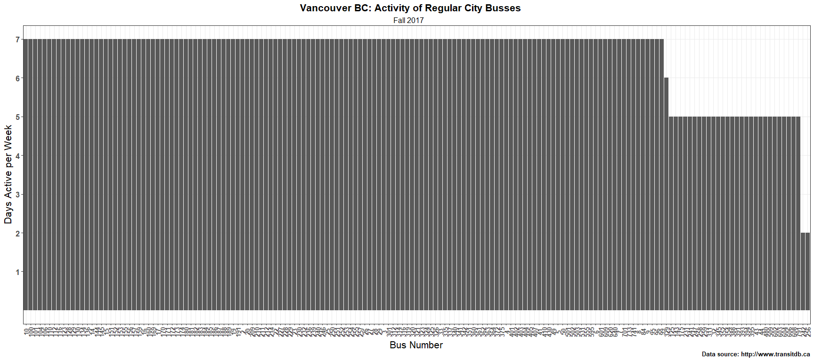
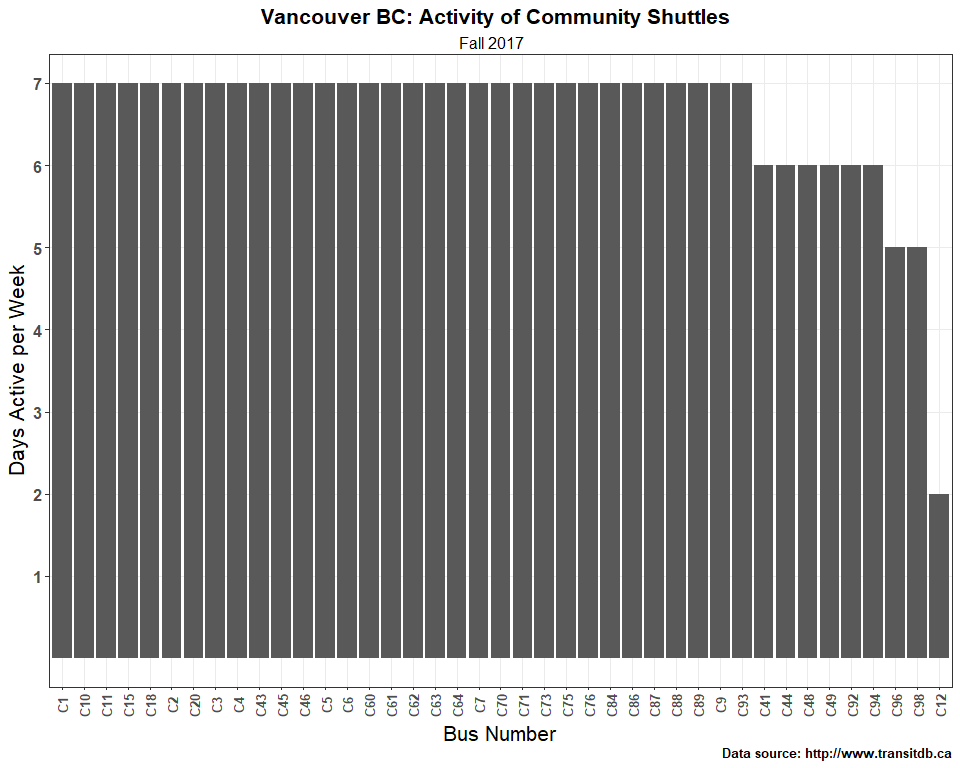
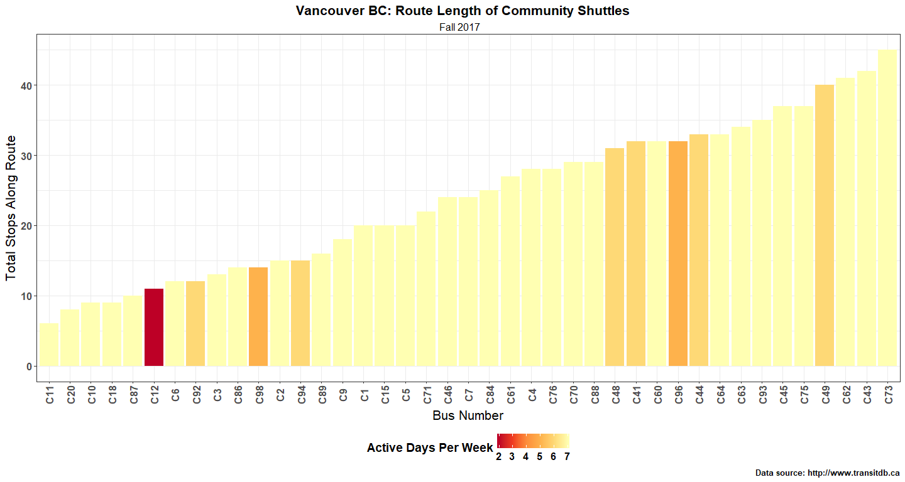

Homework 10 - Data Scraping from the Web
================
Hayden Scheiber -
06 December, 2017

[Return to Main Page](https://github.com/HScheiber/STAT545-hw-Scheiber-Hayden/blob/master/README.md)

[Return to Homework 10 Landing Page](README.md)

------------------------------------------------------------------------

-   [Scrape data](#scrape-data)
    1.  [Scraping the Vancouver Bus Schedules](#scraping-the-vancouver-bus-schedules)
    2.  [Obtaining Lists of Webpage Data](#obtaining-lists-of-webpage-data)
    3.  [We Need to go Deeper](#we-need-to-go-deeper)

------------------------------------------------------------------------

Welcome! This is the final assignment for STAT 547M. The high level objective of this assignment is to explore data scraping from the internet. A link to the assignment itself can be found [here](http://stat545.com/hw10_data-from-web.html "STAT 545 Assignment 10").

------------------------------------------------------------------------

Below is a list of the packages used in the making of this assignment.

``` r
suppressPackageStartupMessages(library(tidyverse))
suppressPackageStartupMessages(library(purrr))
suppressPackageStartupMessages(library(httr))
suppressPackageStartupMessages(library(rvest))
suppressPackageStartupMessages(library(stringr))
suppressPackageStartupMessages(library(glue))
```

Scrape data
-----------

For this assignment I decided against working with an API. To me it seemed that all of the most interesting data from API's were accessable only to people who pay money. Instead I opted to scrape data myself off of a website. I chose a website with a nice big list of (free) data: the [vancouver public transit website](http://www.transitdb.ca).

### Scraping the Vancouver Bus Schedules

<a href="#top">Back to top</a>

For this project, my goal is to do something interesting with some data scraped from the internet. The Vancouver transit website has a [nice big list all of the bus routes](http://www.transitdb.ca/routes/), each of which has its own list of stops and times. However, they aren't simply available to download as a big data set! I'd like to scrape this data, so we will begin by defining this website as our "root url"

``` r
transit_van_url <- 'http://www.transitdb.ca/routes/'
```

The first step is to `GET` the website data using the `httr` package:

``` r
transit_van_info <- GET(transit_van_url)
```

To check that this was successful, we can check the `status_code` of the output:

``` r
transit_van_info$status_code %>%
    http_status()
```

    ## $category
    ## [1] "Success"
    ## 
    ## $reason
    ## [1] "OK"
    ## 
    ## $message
    ## [1] "Success: (200) OK"

Okay so it worked, now time to extract the page `content`:

``` r
transit_van_content <- content(transit_van_info)
```

What exactly are we looking for on this page? Well we can check that using a web browser, as shown below. 

The links we are looking for are all part of the same class: `span-10`. It seems reasonable to try extracting only items within the `span-10` class from our `content`. Each of the components of this list of outputs seems to be separated by a variable number of `newline` characters. The first component in the list is also just the title, and not a bus route. In order to deal with this mess, I build regex expressions to match just the bus numbers as well as the bus number + route name.

I also use the `stingr` package function `str_trim` to remove the `\n` characters from the begining and ends of the textblocks.

The output is a list of all the bus routes and numbers.

``` r
vanc_bus_info <- data_frame(
    Bus_Number = transit_van_content %>%
                            html_nodes(css = ".span-10") %>%
                            html_text() %>%
                            collapse(sep = "\n") %>%
                            str_trim() %>%
                            str_extract_all("\\n(C(\\d)+|N(\\d)+|\\d+) ") %>%
                            map(str_trim),
    
    Bus_Route = transit_van_content %>%
                            html_nodes(css = ".span-10") %>%
                            html_text() %>%
                            collapse(sep = "\n") %>%
                            str_extract_all("(C\\d|N\\d|\\d)(.+)(\\n)+") %>%
                            map(str_trim)
    ) %>%
    unnest

str(vanc_bus_info)
```

    ## Classes 'tbl_df', 'tbl' and 'data.frame':    221 obs. of  2 variables:
    ##  $ Bus_Number: chr  "2" "3" "4" "5" ...
    ##  $ Bus_Route : chr  "2 Macdonald / Downtown" "3 Main / Downtown" "4 Powell / Downtown / UBC" "5 Robson / Downtown" ...

Now I would like to add a label for the bus type (regular, night, or community service). Also I will remove the bus **number** from the bus route as that information is already under the variable `Bus_Number`.

``` r
# Define selector function
bus_type_fun <- function (x) {
    if ( str_detect(x,"^N.+") ){
        output <- "Night Bus"
    }else if(str_detect(x,"^C.+")){
        output <- "Community Shuttle"
    }else{
        output <- "Regular"
    }
    return(output)
}

# Bus Type
vanc_bus_info <- vanc_bus_info %>%
    mutate(Bus_Type = sapply(Bus_Number, bus_type_fun))

# Remove bus Number from bus route column info. Also replace double spaces with single.
vanc_bus_info$Bus_Route <- vanc_bus_info$Bus_Route %>%
    str_replace("(C(\\d)+|N(\\d)+|\\d+) ","") %>%
    str_replace(" +"," ")


knitr::kable(vanc_bus_info %>%
                            head(15)
)
```

| Bus\_Number | Bus\_Route                              | Bus\_Type |
|:------------|:----------------------------------------|:----------|
| 2           | Macdonald / Downtown                    | Regular   |
| 3           | Main / Downtown                         | Regular   |
| 4           | Powell / Downtown / UBC                 | Regular   |
| 5           | Robson / Downtown                       | Regular   |
| 6           | Davie / Downtown                        | Regular   |
| 7           | Nanaimo Station / Dunbar                | Regular   |
| 8           | Fraser / Downtown                       | Regular   |
| 9           | Boundary / Comm-Bwy / Gran / Alma / UBC | Regular   |
| 10          | Granville / Downtown                    | Regular   |
| 14          | Hastings / UBC                          | Regular   |
| 15          | Cambie / Olympic Village Station        | Regular   |
| 16          | 29th Avenue Station / Arbutus           | Regular   |
| 17          | Oak / Downtown                          | Regular   |
| 19          | Metrotown Station / Stanley Park        | Regular   |
| 20          | Victoria / Downtown                     | Regular   |

We have a nice looking data frame already. I would like to add a link to each row that links to the information about the bus route. Its possible to extract this data from the `content` data we already have, which will be in the same order as our data frame.

``` r
vanc_bus_info$Route_Link <- transit_van_content %>%
    html_nodes(css = ".span-10") %>%
    html_nodes("a") %>%
    html_attr("href")

knitr::kable(vanc_bus_info %>%
                            head(15))
```

| Bus\_Number | Bus\_Route                              | Bus\_Type | Route\_Link                          |
|:------------|:----------------------------------------|:----------|:-------------------------------------|
| 2           | Macdonald / Downtown                    | Regular   | <http://www.transitdb.ca/route/002/> |
| 3           | Main / Downtown                         | Regular   | <http://www.transitdb.ca/route/003/> |
| 4           | Powell / Downtown / UBC                 | Regular   | <http://www.transitdb.ca/route/004/> |
| 5           | Robson / Downtown                       | Regular   | <http://www.transitdb.ca/route/005/> |
| 6           | Davie / Downtown                        | Regular   | <http://www.transitdb.ca/route/006/> |
| 7           | Nanaimo Station / Dunbar                | Regular   | <http://www.transitdb.ca/route/007/> |
| 8           | Fraser / Downtown                       | Regular   | <http://www.transitdb.ca/route/008/> |
| 9           | Boundary / Comm-Bwy / Gran / Alma / UBC | Regular   | <http://www.transitdb.ca/route/009/> |
| 10          | Granville / Downtown                    | Regular   | <http://www.transitdb.ca/route/010/> |
| 14          | Hastings / UBC                          | Regular   | <http://www.transitdb.ca/route/014/> |
| 15          | Cambie / Olympic Village Station        | Regular   | <http://www.transitdb.ca/route/015/> |
| 16          | 29th Avenue Station / Arbutus           | Regular   | <http://www.transitdb.ca/route/016/> |
| 17          | Oak / Downtown                          | Regular   | <http://www.transitdb.ca/route/017/> |
| 19          | Metrotown Station / Stanley Park        | Regular   | <http://www.transitdb.ca/route/019/> |
| 20          | Victoria / Downtown                     | Regular   | <http://www.transitdb.ca/route/020/> |

### Obtaining Lists of Webpage Data

<a href="#top">Back to top</a>

We have all the route links now. Here is where things start to get a little crazy. Now I will request the HTML body information from each link and add this to the dataframe (this is about 6MB of data total, and the request may take several minutes).

``` r
collect_html_info <- function (Link){
    read_html(Link) %>%
    html_nodes("body")
}

vanc_bus_linkinfo <- vanc_bus_info %>%
    mutate(Route_HTML = sapply(Route_Link, collect_html_info))

str(vanc_bus_linkinfo, max.level = 1)
```

    ## Classes 'tbl_df', 'tbl' and 'data.frame':    221 obs. of  5 variables:
    ##  $ Bus_Number: chr  "2" "3" "4" "5" ...
    ##  $ Bus_Route : chr  "Macdonald / Downtown" "Main / Downtown" "Powell / Downtown / UBC" "Robson / Downtown" ...
    ##  $ Bus_Type  : Named chr  "Regular" "Regular" "Regular" "Regular" ...
    ##   ..- attr(*, "names")= chr  "2" "3" "4" "5" ...
    ##  $ Route_Link: chr  "http://www.transitdb.ca/route/002/" "http://www.transitdb.ca/route/003/" "http://www.transitdb.ca/route/004/" "http://www.transitdb.ca/route/005/" ...
    ##  $ Route_HTML:List of 221

Okay so now the data frame contains a mess of HTML in the 5th column. We wish to find out interesting things about the bus routes based on the data in this column. One thing we can look at is the service information, which indicates whether or not the bus runs on weekdays, saturday, or sunday/holidays.

``` r
service_check <- function (HTML_body) {
    checks <- HTML_body %>%
        html_nodes(css = ".span-8") %>%
        html_nodes("td") %>%
        html_text
    
    output <- c(NA, NA, NA)
    
    for (i in seq(1,3)) {
        if (checks[i] == "\u{2714}"){
            output[i] <- TRUE
        }else{
            output[i] <- FALSE
        }
    }
    return(output)
}

service_check_weekday <- function(HTML_body){
    output <- service_check(HTML_body)
    return(output[1])
}


service_check_saturday <- function(HTML_body){
    output <- service_check(HTML_body)
    return(output[2])
}


service_check_sunday <- function(HTML_body){
    output <- service_check(HTML_body)
    return(output[3])
}

vanc_bus_linkinfo <- vanc_bus_linkinfo %>%
    mutate(Service_Weekdays = sapply(Route_HTML, service_check_weekday)) %>%
    mutate(Service_Saturday = sapply(Route_HTML, service_check_saturday)) %>%
    mutate(Service_Sunday = sapply(Route_HTML, service_check_sunday))
```

Now we could ask a meaningful question about the Vancouver busses. For example, is bus 620 available on Sundays?

``` r
vanc_bus_linkinfo[vanc_bus_linkinfo$Bus_Number == 620,] %>%
    select(Bus_Number, Service_Sunday)
```

    ## # A tibble: 1 x 2
    ##   Bus_Number Service_Sunday
    ##        <chr>          <lgl>
    ## 1        620           TRUE

What about bus 354?

``` r
vanc_bus_linkinfo[vanc_bus_linkinfo$Bus_Number == 354,] %>%
    select(Bus_Number, Service_Sunday)
```

    ## # A tibble: 1 x 2
    ##   Bus_Number Service_Sunday
    ##        <chr>          <lgl>
    ## 1        354          FALSE

Pretty cool. We can also use this data to make plots of how many days per week each bus runs. I split it up by bus type using `filter` rather than `facet_wrap` because `facet_wrap` output the same x-axis labels for all plots, resulting in 3 overcrowded plots. First I will mutate in a new variable: total working days.

``` r
vanc_bus_linkinfo <- vanc_bus_linkinfo %>%
    mutate(Working_Days = 5*Service_Weekdays + 
                    Service_Saturday + 
                    Service_Sunday)
```

Now we can make a bar plot of bus number vs active days per week.

``` r
vanc_bus_linkinfo %>%
    filter(Bus_Type == "Regular") %>%
    ggplot() +
    geom_bar(aes(x = reorder(Bus_Number, -Working_Days),
            weight = Working_Days)) +
  scale_y_continuous(breaks = seq(1, 7, 1),
      labels = seq(1, 7, 1),
      limits = c(0, 7),
      minor_breaks = NULL) +
  labs(y = "Days Active per Week", 
      x = "Bus Number",
      title = "Vancouver BC: Activity of Regular City Busses",
      subtitle = paste("Fall 2017"),
      caption = "Data source: http://www.transitdb.ca") +
  theme_bw() +
  theme(axis.title = element_text(size=16),
      plot.subtitle = element_text(size=12,hjust = 0.49),
      strip.text = element_text(size=14, face="bold"),
      plot.title = element_text(size=16, face="bold", hjust = 0.49),
      axis.text.x = element_text(size=10,face ="bold", angle = 90, vjust = 0.5),
      axis.text.y = element_text(size=12,face ="bold"),
      legend.title = element_text(size=14, face ="bold"),
      legend.text = element_text(size=12, face ="bold"),
      plot.caption = element_text(size=10, face ="bold"))
```



``` r
vanc_bus_linkinfo %>%
    filter(Bus_Type == "Night Bus") %>%
    ggplot() +
    geom_bar(aes(x = reorder(Bus_Number, -Working_Days),
            weight = Working_Days)) +
  scale_y_continuous(breaks = seq(1, 7, 1),
      labels = seq(1, 7, 1),
      limits = c(0, 7),
      minor_breaks = NULL) +
  labs(y = "Days Active per Week", 
      x = "Bus Number",
      title = "Vancouver BC: Activity of City Busses",
      subtitle = paste("Fall 2017"),
      caption = "Data source: http://www.transitdb.ca") +
  theme_bw() +
  theme(axis.title = element_text(size=16),
      plot.subtitle = element_text(size=12,hjust = 0.49),
      strip.text = element_text(size=14, face="bold"),
      plot.title = element_text(size=16, face="bold", hjust = 0.49),
      axis.text.x = element_text(size=10,face ="bold"),
      axis.text.y = element_text(size=12,face ="bold"),
      legend.title = element_text(size=14, face ="bold"),
      legend.text = element_text(size=12, face ="bold"),
      plot.caption = element_text(size=10, face ="bold"))
```


``` r
vanc_bus_linkinfo %>%
    filter(Bus_Type == "Community Shuttle") %>%
    ggplot() +
    geom_bar(aes(x = reorder(Bus_Number, -Working_Days),
            weight = Working_Days)) +
  scale_y_continuous(breaks = seq(1, 7, 1),
      labels = seq(1, 7, 1),
      limits = c(0, 7),
      minor_breaks = NULL) +
  labs(y = "Days Active per Week", 
      x = "Bus Number",
      title = "Vancouver BC: Activity of Community Shuttles",
      subtitle = paste("Fall 2017"),
      caption = "Data source: http://www.transitdb.ca") +
  theme_bw() +
  theme(axis.title = element_text(size=16),
      plot.subtitle = element_text(size=12,hjust = 0.49),
      strip.text = element_text(size=14, face="bold"),
      plot.title = element_text(size=16, face="bold", hjust = 0.49),
      axis.text.x = element_text(size=10,face ="bold", angle = 90, vjust = 0.5),
      axis.text.y = element_text(size=12,face ="bold"),
      legend.title = element_text(size=14, face ="bold"),
      legend.text = element_text(size=12, face ="bold"),
      plot.caption = element_text(size=10, face ="bold"))
```



Each bus service page contains a link to a timetable for every stop along its route. Perhaps we can try to extract something interesting from this data. First we have to find the link to that timetable from the HTML code in our dataframe. Luckily, I found that each bus route page link has the same `xpath`.

``` r
get_timetable_link <- function (Route_HTML) {
    output <- Route_HTML %>%
        html_nodes(xpath = "/html/body/div[1]/div[3]/div/div[2]/div[2]/p[3]/a") %>%
        html_attr("href")
    
    return(output)
}


vanc_bus_linkinfo <- vanc_bus_linkinfo %>%
    mutate(Timetable_Link = sapply(Route_HTML, get_timetable_link))


vanc_bus_linkinfo %>%
    select(Bus_Number, Timetable_Link) %>%
    head(15) %>%
    knitr::kable()
```

| Bus\_Number   | Timetable\_Link                                     |
|:--------------|:----------------------------------------------------|
| 2             | <http://www.transitdb.ca/route/002/make_timetable/> |
| 3             | <http://www.transitdb.ca/route/003/make_timetable/> |
| 4             | <http://www.transitdb.ca/route/004/make_timetable/> |
| 5             | <http://www.transitdb.ca/route/005/make_timetable/> |
| 6             | <http://www.transitdb.ca/route/006/make_timetable/> |
| 7             | <http://www.transitdb.ca/route/007/make_timetable/> |
| 8             | <http://www.transitdb.ca/route/008/make_timetable/> |
| 9             | <http://www.transitdb.ca/route/009/make_timetable/> |
| 10            | <http://www.transitdb.ca/route/010/make_timetable/> |
| 14            | <http://www.transitdb.ca/route/014/make_timetable/> |
| 15            | <http://www.transitdb.ca/route/015/make_timetable/> |
| 16            | <http://www.transitdb.ca/route/016/make_timetable/> |
| 17            | <http://www.transitdb.ca/route/017/make_timetable/> |
| 19            | <http://www.transitdb.ca/route/019/make_timetable/> |
| 20            | <http://www.transitdb.ca/route/020/make_timetable/> |
| Looks like we | got the right link.                                 |

### We Need to go Deeper

<a href="#top">Back to top</a>

It's time to go one level deeper. We can now extract the HTML code from each of the timetable links! Once again, this process may take several minutes to complete. We can use the same function that we previously created: `collect_html_info`.

``` r
vanc_bus_linkinfo <- vanc_bus_linkinfo %>%
    mutate(Timetable_HTML = sapply(Timetable_Link, collect_html_info))
```

I'm interested in how many stops there are along each route. The Timetable webpage contains a list of all bus stops along that route, so we should be able to extract that list and find its `length`.

``` r
route_stops <- function (HTML_body) {
    stops <- HTML_body %>%
        html_nodes(css = "#stops-in-direction-0") %>%
        html_nodes("tr") %>%
        html_nodes("a") %>%
        length()
    
    return(stops)
}

vanc_bus_linkinfo <- vanc_bus_linkinfo %>%
    mutate(Route_Stops = sapply(Timetable_HTML, route_stops))
```

That worked. Now to make a nice plot of bus route vs number of stops. I decided to split it into 3 plots so that the x-axis isn't so crowded. However `facet_wrap` could not be used to reduce the crowding in this case, as it just kept all bus numbers along the x-axis.

``` r
vanc_bus_linkinfo %>%
    filter(Bus_Type == "Regular") %>%
    ggplot() +
    geom_bar(aes(x = reorder(Bus_Number, Route_Stops),
            weight = Route_Stops, fill = Working_Days)) +
    scale_fill_distiller("Active Days Per Week", palette = "RdPu") +
  labs(y = "Total Stops Along Route", 
      x = "Bus Number",
      title = "Vancouver BC: Route Length of Regular City Busses",
      subtitle = paste("Fall 2017"),
      caption = "Data source: http://www.transitdb.ca") +
  theme_bw() +
  theme(axis.title = element_text(size=16),
      plot.subtitle = element_text(size=12,hjust = 0.49),
      strip.text = element_text(size=14, face="bold"),
      plot.title = element_text(size=16, face="bold", hjust = 0.49),
      axis.text.x = element_text(size=10,face ="bold", angle = 90, vjust = 0.5),
      axis.text.y = element_text(size=12,face ="bold"),
      legend.title = element_text(size=14, face ="bold"),
      legend.text = element_text(size=12, face ="bold"),
      plot.caption = element_text(size=10, face ="bold"),
        legend.position="bottom")
```


``` r
vanc_bus_linkinfo %>%
    filter(Bus_Type == "Night Bus") %>%
    ggplot() +
    geom_bar(aes(x = reorder(Bus_Number, Route_Stops),
            weight = Route_Stops, fill = Working_Days)) +
    scale_fill_distiller("Active Days Per Week", palette = "YlGn") +
  labs(y = "Total Stops Along Route", 
      x = "Bus Number",
      title = "Vancouver BC: Route Length of City Night Busses",
      subtitle = paste("Fall 2017"),
      caption = "Data source: http://www.transitdb.ca") +
  theme_bw() +
  theme(axis.title = element_text(size=16),
      plot.subtitle = element_text(size=12,hjust = 0.49),
      strip.text = element_text(size=14, face="bold"),
      plot.title = element_text(size=16, face="bold", hjust = 0.49),
      axis.text.x = element_text(size=12,face ="bold", angle = 90, vjust = 0.5),
      axis.text.y = element_text(size=12,face ="bold"),
      legend.title = element_text(size=14, face ="bold"),
      legend.text = element_text(size=12, face ="bold"),
      plot.caption = element_text(size=10, face ="bold"),
        legend.position="bottom")
```


``` r
vanc_bus_linkinfo %>%
    filter(Bus_Type == "Community Shuttle") %>%
    ggplot() +
    geom_bar(aes(x = reorder(Bus_Number, Route_Stops),
            weight = Route_Stops, fill = Working_Days)) +
    scale_fill_distiller("Active Days Per Week", palette = "YlOrRd") +
  labs(y = "Total Stops Along Route", 
      x = "Bus Number",
      title = "Vancouver BC: Route Length of Community Shuttles",
      subtitle = paste("Fall 2017"),
      caption = "Data source: http://www.transitdb.ca") +
  theme_bw() +
  theme(axis.title = element_text(size=16),
      plot.subtitle = element_text(size=12,hjust = 0.49),
      strip.text = element_text(size=14, face="bold"),
      plot.title = element_text(size=16, face="bold", hjust = 0.49),
      axis.text.x = element_text(size=12,face ="bold", angle = 90, vjust = 0.5),
      axis.text.y = element_text(size=12,face ="bold"),
      legend.title = element_text(size=14, face ="bold"),
      legend.text = element_text(size=12, face ="bold"),
      plot.caption = element_text(size=10, face ="bold"),
        legend.position="bottom")
```



Pretty neat. I'm happy with this data. Thanks for reading.

<a href="#top">Back to top</a>
